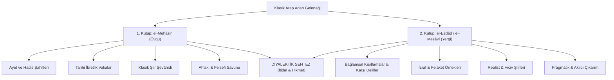

<div align="center">


# el-mehasin-vel-ezdad (كِتَابُ المَحَاسِنِ وَالأَضْدَادِ)
### Klasik Arap Edebiyatında İki Kutuplu Mantık, Diyalektik Adab ve Hesaplamalı Retorik Korpusu

[](scripts/validator.py)
[](LICENSE)
[](#-eserden-metin-içi-seçkiler-ve-diyalektik-kutuplar)
[](data/)
[](scripts/)

> **"Kelimeler zıtlarıyla tartılır; hakikat, iki ucun geriliminde parıldar."**  
> Bu depo; klasik Arap adab külliyatının, belagat teorisinin ve erken dönem İslam rasyonalizminin en çarpıcı türlerinden biri olan **Mehâsin ve Mesâvî / Ezdâd** (Güzellikler-Kusurlar / Karşıtlıklar) literatürünü; tenkitli metin neşirleri, tarihsel şerhler, modern edebi eleştiriler, zengin şiir şahitleri (*şevâhid*) ve yapılandırılmış diyalektik veri modelleriyle dijital çağa aktaran kapsamlı bir beşeri bilimler (Digital Humanities) ve hesaplamalı retorik külliyatıdır.

</div>

---

## 📖 Genişletilmiş İçindekiler

1. [Proje Vizyonu ve Kapsamı](#-proje-vizyonu-ve-kapsamı)
2. [Tarihsel, Felsefi ve Epistemolojik Arka Plan](#-tarihsel-felsefi-ve-epistemolojik-arka-plan)
3. [Müelliflik ve Metin Tenkidi Meselesi: Câhiz mi, Beyhakî mi?](#-müelliflik-ve-metin-tenkidi-meselesi-câhiz-mi-beyhakî-mi)
4. [Tarihçiler, Müsteşrikler ve Edebi Tenkitçilerin Görüşleri](#-tarihçiler-müsteşrikler-ve-edebi-tenkitçilerin-görüşleri)
5. [Eserden Metin İçi Seçkiler, Genişletilmiş Alıntılar ve Şevâhid](#-eserden-metin-içi-seçkiler-genişletilmiş-alıntılar-ve-şevâhid)
   * [1. Sükût (Susmak) vs. Kelâm (Konuşmak/Beyân)](#1-sükût-susmak-vs-kelâm-konuşmakbeyân)
   * [2. Cûd (Cömertlik) vs. Buhl (Cimrilik/Tasarruf)](#2-cûd-cömertlik-vs-buhl-cimriliktasarruf)
   * [3. Şecâat (Cesaret) vs. Hazm/Cübn (İhtiyat/Korkaklık)](#3-şecâat-cesaret-vs-hazmcübn-ihtiyatkorkaklık)
   * [4. Işk (Tutkulu Aşk) vs. Silvân (Unutuş/Akılcılık)](#4-ışk-tutkulu-aşk-vs-silvân-unutuşakılcılık)
   * [5. Vefâ (Bağlılık) vs. Zemmü'l-İğtirâr (Temkin/Mesafe)](#5-vefâ-bağlılık-vs-zemmül-iğtirâr-temkinmesafe)
   * [6. İlim (Hikmet/Nûr) vs. Rahatü'l-Cehl (Cehaletin Konforu)](#6-ilim-hikmetnûr-vs-rahatül-cehl-cehaletin-konforu)
   * [7. Uzlet (İnzivâ/Halvet) vs. Hılta (Toplumsallık/Muâşeret)](#7-uzlet-inzivâhalvet-vs-hılta-toplumsallıkmuâşeret)
   * [8. Medih (Övgü/Teşvik) vs. Hiciv (Yergi/Teşhir)](#8-medih-övgüteşvik-vs-hiciv-yergiteşhir)
   * [9. Sabır (Metanet/Rıza) vs. Ceze' (Kederin İfşası/Ağıt)](#9-sabır-metanetrıza-vs-ceze-kederin-ifşasıağıt)
   * [10. Tevâzu (Mahviyet) vs. Kibr ale'l-Mütekebbirîn (İzzet/Celadet)](#10-tevâzu-mahviyet-vs-kibr-alel-mütekebbirîn-izzetceladet)
6. [Diyalektik Kutuplar ve Retorik Figürler Matrisi](#-diyalektik-kutuplar-ve-retorik-figürler-matrisi)
7. [Retorik Sanatlar ve Belagat Morfolojisi](#-retorik-sanatlar-ve-belagat-morfolojisi)
8. [Modern NLP, LLM ve Hesaplamalı Beşeri Bilimler Senaryoları](#-modern-nlp-llm-ve-hesaplamalı-beşeri-bilimler-senaryoları)
9. [Depo Mimarisi ve Veri Şeması](#-depo-mimarisi-ve-veri-şeması)
10. [Katkı Sağlama ve İnceleme Süreci](#-katkı-sağlama-ve-inceleme-süreci)
11. [Genişletilmiş Bibliyografya ve Kaynakça](#-genişletilmiş-bibliyografya-ve-kaynakça)

---

## 🎯 Proje Vizyonu ve Kapsamı

Tarih boyunca Ebû Osmân Amr b. Bahr el-Câhiz’e (ö. 255/869) nispet edilen, ancak modern metin tenkidi çalışmalarıyla İbrâhim b. Muhammed el-Beyhakî (ö. IV./X. yüzyıl) ve meçhul müelliflerin katkılarıyla şekillendiği anlaşılan *Kitâbü'l-Mehâsin ve'l-Ezdâd*, basit bir ahlaki nasihatnâme veya anekdot derlemesi değildir.

Bu külliyat:
* **İki Kutuplu Mantık (Bipolar Dialectic):** Bir tezin zıddı olmadan ontolojik ve retorik olarak tam kavranamayacağını savunan yüksek bir zihin jimnastiğidir.
* **Münazara ve Adab Akrobasisi:** Abbâsî sarayında vezir, kâtip, fakih ve nedimlerin meclislerde sergilediği entelektüel çevikliğin, dil cambazlığının ve ikna sanatının zirve metnidir.
* **Modern NLP ve LLM’ler İçin Altın Maden:** Zıt kutuplu argüman madenciliği (*argument mining*), anlamsal tersinirlik (*semantic antonymy*), çok dilli duygu analizi kutuplaşması (*sentiment polarity*), karşılaştırmalı akıl yürütme (*contrastive reasoning*) ve klasik retorik ontolojileri için eşsiz bir laboratuvardır.

Bu projenin temel hedefi; eserin orijinal Arapça metinlerini tahkikli neşirlerden derlemek, açıklayıcı Türkçe şerhler ve İngilizce terminolojiyle eşleştirmek; her bir kavramsal ikiliği JSON Schema ile doğrulanmış JSONL formatında makinece işlenebilir, yapay zekâ modellerince eğitilebilir bir araştırma korpusu haline getirmektir.

---

## 🏛️ Tarihsel, Felsefi ve Epistemolojik Arka Plan

Abbâsî hilafetinin başkenti Bağdat ve Basra-Kûfe ekolleri; Grek felsefe ve mantığının (özellikle Aristoteles'in *Organon*, *Topika* ve *Rhetorika* eserlerinin), Sasani-Fars bürokratik saray adabının (*Kitâb-ı Âdâb*) ve kadim Câhiliye Arap şiir zevkinin harmanlandığı küresel bir düşünce kazanıydı.

Mutezile kelâmının tartışma kültürünü şekillendirdiği bu altın çağda;
1. **İkna Sanatı (Persuasion):** Hakikatin tek bir dogmatik formülle değil, şartların ve bağlamın getirdiği değişkenlerle kavranabileceği savunuluyordu.
2. **Kelimelerin Zıt Anlamlılığı (*el-Ezdâd*):** Arap dilinde aynı kelimenin hem bir anlamı hem de tam zıddını ifade edebilmesi (örneğin *el-Cevn* kelimesinin hem siyah hem beyaz anlamına gelmesi gibi), zihinsel diyalektiğin dilbilimsel temeliydi.
3. **Konjonktürel Ahlak:** Cömertlik mutlak bir erdemdir; ancak ailenin rızkını tüketip çocukları sefalete terk eden cömertlik ahmaklıktır. Suskunluk bilgeliktir; fakat haksızlık karşısında susmak dilsiz şeytanlıktır.



---

## 🧐 Müelliflik ve Metin Tenkidi Meselesi: Câhiz mi, Beyhakî mi?

*Kitâbü'l-Mehâsin ve'l-Ezdâd* adlı eserin aidiyeti, şarkiyatçılar ve İslam araştırmacıları arasında yüzyılı aşkın süredir tartışılan temel bir filolojik problemdir:

* **Gerlof van Vloten (1898 Neşri):** Leiden'de eseri ilk kez neşreden van Vloten, eserin bizzat Câhiz'e ait olduğunu savunmuştur. Üslubun canlılığı, hiciv gücü ve felsefi nüktedanlık Câhiz'in *el-Beyân ve't-Tebyîn* ve *Kitâbü'l-Hayavân* eserleriyle derin paralellikler taşır.
* **Charles Pellat ve Brockelmann:** Pellat, eserin Câhiz'in ölümünden sonra IV./X. yüzyılda yaşamış İbrâhim b. Muhammed el-Beyhakî'nin *el-Mehâsin ve'l-Mesâvî* adlı eseriyle büyük benzerlikler gösterdiğini belirterek metni **Pseudo-Jahiz (Câhiz'e Nispet Edilen)** kategorisinde değerlendirmiştir.
* **Şinasi Gündüz ve Modern Tenkitçiler:** Eser ister doğrudan Câhiz'in kaleminden çıkmış olsun ister onun ekolünü takip eden Beyhakî veya bir başkası tarafından derlenmiş olsun; erken dönem Abbâsî nesrinin diyalektik dehasını, saray kâtiplerinin retorik antrenmanlarını ve İslam aydınlanmasının ikili düşünce yapısını en berrak yansıtan anıt eserdir.

---

## 💬 Tarihçiler, Müsteşrikler ve Edebi Tenkitçilerin Görüşleri

> [!NOTE]
> **Gerlof van Vloten (Hollandalı Şarkiyatçı, Eserin İlk Modern Editörü - 1898):**  
> *"Bu eser, Doğuluların zıt kavramları ele alışındaki müstesna esnekliği ve belagat dehasını belgeler. Yazar, bir yandan en ulvi ahlaki faziletleri göklere çıkarırken, hemen ardından aynı kavramın yıkıcı sonuçlarını öyle bir ustalıkla sergiler ki, okuyucu hakikatin tek bir kutba hapsedilemeyeceğini hayretle idrak eder."*

> [!TIP]
> **İbn Hallikân (Vefeyâtü'l-A'yân Müellifi):**  
> *"Câhiz ve onun yolundan giden edebiyat ustaları, sözü diledikleri gibi evirip çevirmekte mahirdirler. Bir şeyi hem överler hem de yererler; her iki halde de dinleyeni büyüler, delillerinin kuvveti karşısında muhatabı hayrete düşürürler."*

> [!IMPORTANT]
> **Charles Pellat (The Encyclopaedia of Islam / Câhiz Uzmanı):**  
> *"Mehâsin ve Mesâvî edebiyatı, klasik Arap nesrinin en tipik adab türlerinden biridir. Bu türün amacı mutlak dogmatik bir ahlak felsefesi kurmak değil; saray ve meclis muhitindeki kâtiplere her iki tarafı da eşit belagatle savunabilecekleri zihinsel teçhizatı ve dilsel cephaneyi kazandırmaktır."*

> [!NOTE]
> **Prof. Dr. Şinasi Gündüz / Klasik Edebiyat Araştırmacıları:**  
> *"Câhiz’e atfedilen Mehâsin ve'l-Ezdâd, zıtların birliğinden ziyade zıtların çatışmasındaki estetiği hedefler. Arapça'daki zıt anlamlı kelimeler (ezdâd) mantığı ile insanın ahlaki eylemleri arasındaki paralellik bu eserde somutlaşır. İnsan tek bir erdemle tanımlanamaz; şartların doğurduğu karşıtlıklar bütünüdür."*

> [!TIP]
> **Regis Blachère (Arap Edebiyatı Tarihçisi):**  
> *"Bu metinler, ortaçağ İslam dünyasında diyalektiğin ve sofistike münazaranın bir oyuna, yüksek bir sanat formuna dönüşmüş halidir. Burada ahlak, dilin ve zekânın emrine girmiştir."*

---

## 📜 Eserden Metin İçi Seçkiler, Genişletilmiş Alıntılar ve Şevâhid

Aşağıda, eserde yer alan 10 temel kavramsal ikiliğin orijinal metin mantığına, şiir şahitlerine (*şevâhid*), hadis ve hikmet iktibaslarına sadık kalınarak derlenmiş genişletilmiş dökümleri yer almaktadır.

---

### 1. Sükût (Susmak) vs. Kelâm (Konuşmak/Beyân)

#### 🟢 Mehâsinü's-Samt (Susmanın Güzellikleri ve Erdemleri)
* **Temel Argüman:** Suskunluk; nefsin afetlerinden (yalan, gıybet, riya, iftira) korunma zırhı, cahil için perde, âlim için vakar süsüdür. Söylenmemiş sözün sahibi insan iken, söylenen sözün kölesi insandır.
* **Lokman Hekim'in Vasiyeti:**
  > *"يا بني، إن كان الكلام من فضة فإن الصمت من ذهب. ولقد ندمت على الكلام مراراً، ولم أندم على الصمت مرة واحدة."*  
  > *(Ey oğul! Söz gümüş ise sükût altındır. Konuştuğum için defalarca pişman oldum, fakat sustuğum için bir kez bile nedamet getirmedim.)*
* **Şiir Şahidi (el-Mufaddaliyyât):**
  > *يَمُوتُ الفَتَى مِنْ عَثْرَةٍ بِلِسَانِهِ *** وَلَيْسَ يَمُوتُ المَرْءُ مِنْ عَثْرَةِ الرِّجْلِ*  
  > *فَعَثْرَتُهُ مِنْ فِيهِ تَرْمِي بِرَأْسِهِ *** وَعَثْرَتُهُ بِالرِّجْلِ تَبْرَأُ عَلَى مَهْلِ*  
  > *(Yiğit, dili sürçtüğü için helak olur; ayağı sürçtüğü için değil! Ağzından çıkan bir sürçme onun başını koparır; oysa ayaktan gelen sürçme zamanla iyileşir.)*
* **Hz. Ömer'in (r.a.) İhtarı:**
  > *"من كثر كلامه كثر سقطه، ومن كثر سقطه قل حياؤه، ومن قل حياؤه قل ورعه، ومن قل ورعه مات قلبه."*  
  > *(Kimin sözü çok olursa hatası çok olur; hatası çok olanın hayası azalır; hayası azalanın takvası erir; takvası eriyenin ise kalbi ölür.)*

#### 🔴 Mehâsinü'l-Kelâm / Zemmü's-Samt (Konuşmanın Fazileti ve Susmanın Yergisi)
* **Temel Argüman:** Kelâm olmaksızın peygamberlerin tebliği, adaletin ikamesi ve hikmetin nakli imkansızdır. Konuşma kabiliyeti (*nutk*), insanı hayvandan ayıran ilahi bir bağıştır.
* **Kur'an Delili:**
  > *«الرَّحْمَنُ • عَلَّمَ الْقُرْآنَ • خَلَقَ الْإِنسَانَ • عَلَّمَهُ الْبَيَانَ»* (er-Rahmân: 1-4)  
  > *(Rahmân olan Allah; Kur'ân'ı öğretti, insanı yarattı ve ona beyânı [açıkça ifade etmeyi] öğretti.)*
* **Hz. Ali'nin (k.v.) Hikmeti:**
  > *تَكَلَّمُوا تُعْرَفُوا، فَإِنَّ المَرْءَ مَخْبُوءٌ تَحْتَ طَيِّ لِسَانِهِ لَا طَيْلَسَانِهِ*  
  > *(Konuşunuz ki bilinesiniz; zira insan sarığının ve cübbesinin altında değil, dilinin kıvrımları altında gizlidir.)*
* **Ebû Ali ed-Dekkâk:**
  > *"الساكت عن الحق شيطان أخرس، والمتكلم بالباطل شيطان ناطق."*  
  > *(Hakkı söylemekten kaçınarak susan dilsiz şeytandır; batılı konuşan ise nutuk atan şeytandır.)*

---

### 2. Cûd (Cömertlik) vs. Buhl (Cimrilik/Tasarruf)

#### 🟢 Mehâsinü'l-Cûd ve's-Sehâ (Cömertliğin Övgüsü)
* **Temel Argüman:** Cömertlik, sahibinin bütün ayıplarını örten, nesiller boyu övgüyle anılmasını sağlayan ve insanı hem Yaradan'a hem de yaratılanlara sevdiren en yüce mürüvvet faziletidir.
* **Hâtem et-Tâî'nin Eşi Mâviye'ye Hitabı:**
  > *أَمَاوِيَّ إِنَّ المَالَ غَادٍ وَرَائِحٌ *** وَيَبْقَى مِنَ المَالِ الأَحَادِيثُ وَالذِّكْرُ*  
  > *أَمَاوِيَّ إِنِّي لَا أَقُولُ لِسَائِلٍ *** إِذَا جَاءَنِي يَوْمًا حَلَلْتَ عَلَى عُسْرِ*  
  > *(Bilesin ki ey Mâviye! Mal sabah gelir akşam gider; maldan geriye kalan sadece güzel sohbetler ve asil yaddır. Ey Mâviye! Kapıma gelen hiçbir muhtaca 'darlık günümde geldin' deyip onu boş çevirmem!)*
* **Ebû Temmâm'ın Medhiyesi:**
  > *يَجُودُ بِالنَّفْسِ إِذْ ضَنَّ البَخِيلُ بِهَا *** وَالجُودُ بِالنَّفْسِ أَقْصَى غَايَةِ الجُودِ*  
  > *(Cimrinin malını bile esirgediği yerde o canını ortaya koyar; canı cömertçe feda etmek ise cömertliğin varabileceği en son sınırdır.)*
* **Hadis-i Şerif:**
  > *"السخي قريب من الله، قريب من الجنة، قريب من الناس، بعيد من النار."* (Tirmizî)

#### 🔴 Mehâsinü'l-Buhl ve'l-İktisâd (Tasarrufun/Cimriliğin Müdafaası)
* **Temel Argüman:** Sınırsız ve tedbirsiz cömertlik, kişiyi başkalarına muhtaç kılan bir tebzirdir (israf). Mal insanın haysiyet zırhı, dinin ve ailesinin teminatıdır.
* **el-Câhiz (Kitâbü'l-Buhalâ):**
  > *"درهمك هو حريتك وعزك وسترك؛ فإذا ذهب مالك صرت كلاً على الناس، وتنكر لك الصديق، واجترأ عليك الدنيء."*  
  > *(Dirhemin senin hürriyetin, izzetin ve örtündür. Malın tükendiğinde insanlara yük olursun; en yakın dostun sana yabancılaşır ve en bayağı insanlar sana dil uzatmaya cüret eder.)*
* **Hadis ve Fıkıh Delili:**
  > *«مَا عَالَ مَنْ اقْتَصَدَ»* *(Tasarruf eden darlığa düşmez.)*  
  > *«إِنَّكَ أَنْ تَذَرَ وَرَثَتَكَ أَغْنِيَاءَ خَيْرٌ مِنْ أَنْ تَذَرَهُمْ عَالَةً يَتَكَفَّفُونَ النَّاسَ»* (Buhârî, Cenâiz)

---

### 3. Şecâat (Cesaret) vs. Hazm/Cübn (İhtiyat/Korkaklık)

#### 🟢 Mehâsinü'ş-Şecâa (Cesaretin Fazileti)
* **Temel Argüman:** Cesaret, ruhun izzeti ve nefsin ölüm korkusunu yenmesidir. Korkak bin defa ölür, cesur insan ancak bir defa ölür.
* **el-Mütenebbî'nin Şaheser Beyitleri:**
  > *إِذَا غَامَرْتَ فِي شَرَفٍ مَرُومِ *** فَلَا تَقْنَعْ بِمَا دُونَ النُّجُومِ*  
  > *فَطَعْمُ المَوْتِ فِي أَمْرٍ حَقِيرٍ *** كَطَعْمِ المَوْتِ فِي أَمْرٍ عَظِيمِ*  
  > *يَرَى الجُبَنَاءُ أَنَّ العَجْزَ عَقْلٌ *** وَتِلْكَ خَدِيعَةُ الطَّبْعِ اللَّئِيمِ*  
  > *(Eğer yüce bir şerefe talip olduysan, yıldızların altındaki hiçbir bayağılığa razı olma! Zira küçük ve değersiz bir iş uğruna ölmenin tadı ne ise, büyük ve şerefli bir gaye uğruna ölmenin tadı da birdir. Korkaklar acizliklerini akıllılık sanırlar; oysa bu, alçak bir tabiatın kendi kendini aldatmasından ibarettir!)*

#### 🔴 Mehâsinü'l-Hazm / Zemmü't-Tehevvür (Tedbir ve Canı Muhafaza Etmenin Övgüsü)
* **Temel Argüman:** Gözü kapalı ateşe atılmak kahramanlık değil akılsızlıktır (*tehevvür*). İhtiyat (*hazm*), aklın kalkanıdır. Canını ve ordusunu muhafaza eden kumandan üstündür.
* **el-Mütenebbî (Akıl Önceliği):**
  > *الرَّأْيُ قَبْلَ شَجَاعَةِ الشُّجْعَانِ *** هُوَ أَوَّلٌ وَهِيَ المَحَلُّ الثَّانِي*  
  > *فَإِذَا هُمَا اجْتَمَعَا لِنَفْسٍ مِرَّةٍ *** بَلَغَتْ مِنَ العَلْيَاءِ كُلَّ مَكَانِ*  
  > *(Stratejik akıl ve doğru basiret, yiğitlerin cesaretinden önce gelir; akıl birinci sırada, cesaret ise ikinci mertebededir. Eğer bu ikisi asil bir nefiste birleşirse, o insan yüceliğin zirvesine ulaşır.)*
* **Ahnef b. Kays:**
  > *"الحزم سوء الظن بالعدو، وتوقع المكاره قبل وقوعها، وإعداد العدة لدفعها."*

---

### 4. Işk (Tutkulu Aşk) vs. Silvân (Unutuş/Akılcılık)

#### 🟢 Mehâsinü'l-Işk (Aşkın Ruhu Yüceltmesi)
* **Temel Argüman:** Aşk; kaba ruhları incelten, cimriyi cömert kılan, korkağa cesaret aşılayan ilahi ve estetik bir cevherdir. Seven insan sevdiğinin aynasında kemale erer.
* **Mecnûn-ı Âmirî (Kays b. el-Mülavvah):**
  > *وَمَا سَعَادَتِي إِلَّا فِي شَقَائِي بِحُبِّهَا *** وَمَا لَذَّتِي إِلَّا بِوَجْدٍ وَلَوْعَةِ*  
  > *فَلَو قِيلَ لِي رَانَ الفُؤَادُ لَقُلْتُ لَا *** وَلَكِنَّهُ فِي نُورِ لَيْلَى يَتِيمُ*  
  > *(Benim saadetim ancak onun aşkıyla çektiğim çilededir; lezzetim ise ancak o yangın ve vecd iledir. Bana 'kalbin karardı mı' deseler 'hayır!' derim; bilakis kalbim Leylâ'nın nurunda yetim kalmış bir seyyahtır.)*

#### 🔴 Mesâvîü'l-Işk ve Mehâsinü's-Silvân (Aşkın Helaki ve Aklın Kurtuluşu)
* **Temel Argüman:** Aşk bir hastalıktır, iradenin bir faniye teslim edilerek felç edilmesidir. Kurtuluş *silvân*da (teselli, unutuş ve aklın bağımsızlığını geri kazanmasında) yatar.
* **Eflâtun-ı İlâhî Rivayeti:**
  > *"العشق حركة النفس الفارغة من جلائل الأمور، إذا لم تجد عملاً شريفاً يشغلها تعلقت بالصور."*  
  > *(Aşk, yüce gayelerden mahrum kalmış boş bir nefsin debelenişidir; meşgul olacak şerefli bir vazife bulamadığında suretlere takılıp kalır.)*
* **Ebû Nuvâs:**
  > *دَعْ عَنْكَ لَوْمِي فَإِنَّ اللَّوْمَ إِغْرَاءُ *** وَدَاوِنِي بِالَّتِي كَانَتْ هِيَ الدَّاءُ*

---

### 5. Vefâ (Bağlılık) vs. Zemmü'l-İğtirâr (Temkin/Mesafe)

#### 🟢 Mehâsinü'l-Vefâ (Dostluk ve Ahde Vefa)
* **Temel Argüman:** Vefa asil ruhların süsüdür. Emaneti korumak ve ahde sadık kalmak uğruna can ve evlat feda edilir.
* **Semev’el b. Âdiyâ Meseli:**
  > *Semev'el, kendisine emanet edilen zırhları teslim etmemek için muhasara altındayken düşmanın rehin aldığı öz oğlunu gözleri önünde katletmesine razı olmuş ve ahdine hıyanet etmemiştir. Araplar arasında darb-ı mesel olmuştur: «أَوْفَى مِنَ السَّمَوْأَلِ» (Semev'el'den daha vefalı).*
* **İmâm-ı Şâfiî Divanı:**
  > *إِذَا المَرْءُ لَا يَرْعَاكَ إِلَّا تَكَلُّفًا *** فَدَعْهُ وَلَا تُكْثِرْ عَلَيْهِ التَّأَسُّفَا*  
  > *فَفِي النَّاسِ أَبْدَالٌ وَفِي التَّرْكِ رَاحَةٌ *** وَفِي القَلْبِ صَبْرٌ لِلحَبِيبِ وَلَوْ جَفَا*  
  > *(Eğer bir insan sana ancak yapmacık bir külfetle ilgi gösteriyorsa, onu terk et ve arkasından sakın eseflenme! Zira insanlarda alternatif çoktur, terketmekte rahatlık vardır; cefakar olsa dahi sabredecek yürek bulunur.)*

#### 🔴 Zemmü'l-İğtirâr bi'n-Nâs (İnsanlara Aşırı Güvenin Yergisi ve Tedbir)
* **Temel Argüman:** İnsanların menfaat üzerine kurulu dostluklarına güvenip savunmasız kalmak ahmaklıktır.
* **İbnü'l-Mu'tez'in Uyarısı:**
  > *احْذَرْ عَدُوَّكَ مَرَّةً وَاحْذَرْ صَدِيقَكَ أَلْفَ مَرَّةٍ*  
  > *فَلَرُبَّمَا انْقَلَبَ الصَّدِيقُ فَكَانَ أَعْلَمَ بِالمَضَرَّةِ*  
  > *(Düşmanından bir kez sakın, fakat dostundan bin kez sakın! Zira bir gün dostun düşmana dönerse sana nereden ve nasıl zarar vereceğini en iyi o bilir.)*

---

### 6. İlim (Hikmet/Nûr) vs. Rahatü'l-Cehl (Cehaletin Konforu)

#### 🟢 Mehâsinü'l-İlm (İlmin Yüceliği)
* **Temel Argüman:** İlim insanı meleklerden üstün kılan nurdur.
* **Hz. Ali'nin (k.v.) Hikmetli Beyti:**
  > *العِلْمُ يَرْفَعُ بَيْتًا لَا عِمَادَ لَهُ *** وَالجَهْلُ يَهْدِمُ بَيْتَ العِزِّ وَالشَّرَفِ*  
  > *تَعَلَّمْ فَلَيْسَ المَرْءُ يُولَدُ عَالِمًا *** وَلَيْسَ أَخُو عِلْمٍ كَمَنْ هُوَ جَاهِلُ*  
  > *(İlim, direksiz haneleri göklere yükseltir; cehalet ise şeref ve asalet saraylarını temellerinden yıkar. Öğren! Zira hiç kimse anasından âlim doğmaz; ilim sahibi olanla cahil kalan asla bir olmaz!)*

#### 🔴 Rahatü'l-Cehl ve Âfâtü'l-İlm (Cehaletin Rahatlığı ve İlmin Kederi)
* **Temel Argüman:** İlim derinleştikçe varoluşsal keder, sorumluluk ve şüphe artar. Cahil ise tasasızca ömrünü tüketir.
* **el-Mütenebbî:**
  > *ذُو العَقْلِ يَشْقَى فِي النَّعِيمِ بِعَقْلِهِ *** وَأَخُو الجَهَالَةِ فِي الشَّقَاوَةِ يَنْعَمُ*  
  > *(Akıl ve idrak sahibi, nimetler ve bolluk içinde dahi aklının getirdiği kederle kıvranır; cahil kimse ise sefaletin ortasında tasasızca keyif sürer.)*
* **Lokman Hekim Nakli:** *"من زاد علمه زاد حزنه، ومن كثر فهمه قل قراره."*

---

### 7. Uzlet (İnzivâ/Halvet) vs. Hılta (Toplumsallık/Muâşeret)

#### 🟢 Mehâsinü'l-Uzle (Yalnızlığın Fazileti)
* **Temel Argüman:** İnsanların fitnesinden, riyadan ve hasetten uzaklaşıp kalbi arındırmanın yolu halvet ve uzlettir.
* **Fudayl b. İyâz:**
  > *"العزلة حصن حصين من آفات اللسان، وسلامة من التصنع للخلق، ومن استوحش من الوحدة فذلك لقلة أنسه بالله."*
* **Arap Şiir Şahidi:**
  > *سَلَامٌ عَلَى أَهْلِ القُبُورِ فَإِنَّهُمْ *** نَجَوْا مِنْ أَذَى الدُّنْيَا وَغَدْرِ الخَلَائِقِ*  
  > *(Kabir ehline selam olsun! Zira onlar dünyanın eziyetinden ve yaratılmışların kahredici vefasızlığından kurtuldular.)*

#### 🔴 Mehâsinü'l-Hılta (Toplumsallığın ve Cemaatin Fazileti)
* **Temel Argüman:** İnsan medenî-i bittab'dır (sosyal bir varlıktır). Cemaat rahmettir; cihad, ilim tedrisi ve dayanışma ancak toplum içinde kaimdir.
* **Hadis-i Şerif:**
  > *«المُؤْمِنُ الَّذِي يُخَالِطُ النَّاسَ وَيَصْبِرُ عَلَى أَذَاهُمْ خَيْرٌ مِنَ الَّذِي لَا يُخَالِطُهُمْ وَلَا يَصْبِرُ عَلَى أَذَاهُمْ»* (İbn Mâce)
* **Ahnef b. Kays:** *"المرء بأخيه، واليد بالساعد، والكثرة سياج منيع ضد عوادي الزمان."*

---

### 8. Medih (Övgü/Teşvik) vs. Hiciv (Yergi/Teşhir)

#### 🟢 Mehâsinü'l-Medh (Övgünün Fazileti)
* **Temel Argüman:** Medih, erdemleri yeşerten, iyiliği çoğaltan ve asil ruhları gayrete getiren manevi bir mükâfattır.
* **Kâ'b b. Züheyr (Bânet Suâd Kasidesi):**
  > *إِنَّ الرَّسُولَ لَسَيْفٌ يُسْتَضَاءُ بِهِ *** مُهَنَّدٌ مِنْ سُيُوفِ اللَّهِ مَسْلُولُ*  
  > *(Şüphesiz Resûlullah, kendisinden nur alınan bir ışıktır; Allah'ın çekilmiş yalınkılıç çelik kılıçlarından bir kılıçtır!)*

#### 🔴 Mehâsinü'l-Hicâ (Hicvin Caydırıcılığı)
* **Temel Argüman:** Hiciv, haddini aşan mütekebbirleri, hasis zenginleri ve zalimleri terbiye eden edebi bir kılıçtır.
* **Hassân b. Sâbit'in Müşriklere Karşı Meydan Okuması:**
  > *هَجَوْتَ مُحَمَّدًا فَأَجَبْتُ عَنْهُ *** وَعِنْدَ اللَّهِ فِي ذَاكَ الجَزَاءُ*  
  > *فَإِنَّ أَبِي وَوَالِدَهُ وَعِرْضِي *** لِعِرْضِ مُحَمَّدٍ مِنْكُمْ وِقَاءُ*  
  > *(Sen Muhammed'i hicvettin, ben de ona cevap verdim; bunun mükâfatı Allah katındadır. Şüphesiz babam, dedem ve bütün namusum, Muhammed'in şeref ve namusuna kalkan ve fedadır!)*

---

### 9. Sabır (Metanet/Rıza) vs. Ceze' (Kederin İfşası/Ağıt)

#### 🟢 Mehâsinü's-Sabr (Sabrın Fazileti)
* **Temel Argüman:** Sabır imanın yarısı, musibet dalgalarına karşı ruhun aşılmaz kalesidir.
* **Kur'an Müjdesi:**
  > *«إِنَّمَا يُوَفَّى الصَّابِرُونَ أَجْرَهُم بِغَيْرِ حِسَابٍ»* (ez-Zümer: 10)
* **Hz. Ali'nin (k.v.) Temsili:**
  > *"الصبر من الإيمان بمنزلة الرأس من الجسد؛ فإذا ذهب الرأس ذهب الجسد، وإذا ذهب الصبر ذهب الإيمان."*
* **Şairin Haykırışı:**
  > *سَأَصْبِرُ حَتَّى يَعْجَزَ الصَّبْرُ عَنْ صَبْرِي *** وَأَصْبِرُ حَتَّى يَأْذَنَ اللَّهُ فِي أَمْرِي*

#### 🔴 Mehâsinü'l-Ceze' ve't-Teessüf (Hüznü Dışa Vurmanın Rahatlığı)
* **Temel Argüman:** Kederi içine hapsetmek kalbi kurutur. Gözyaşı rahmettir ve fıtrattır.
* **Hz. Yakub'un (a.s.) Feryadı:**
  > *«قَالَ إِنَّمَا أَشْكُو بَثِّي وَحُزْنِي إِلَى اللَّهِ»* (Yûsuf: 86)
* **Fuzûlî / Kadim Adab Rivayeti:**
  > *Gözyaşı dökmek kalpteki keder hararetini teskin eder; feryat etmek içteki zehri akıtır.*

---

### 10. Tevâzu (Mahviyet) vs. Kibr ale'l-Mütekebbirîn (İzzet/Celadet)

#### 🟢 Mehâsinü't-Tevâzu (Tevazuun Güzelliği)
* **Temel Argüman:** Tevazu makam ve büyüklüğün yegâne süsüdür.
* **Hadis-i Şerif:**
  > *«وَمَا تَوَاضَعَ أَحَدٌ لِلَّهِ إِلَّا رَفَعَهُ اللَّهُ»* (Müslim)
* **Hikmet Şiiri:**
  > *تَوَاضَعْ تَكُنْ كَالنَّجْمِ لَاحَ لِنَاظِرٍ *** عَلَى صَفَحَاتِ المَاءِ وَهْوَ رَفِيعُ*  
  > *وَلَا تَكُ كَالدُّخَانِ يَرْفَعُ نَفْسَهُ *** إِلَى طَبَقَاتِ الجَوِّ وَهْوَ وَضِيعُ*  
  > *(Tevazu göster ki, suyun yüzeyinde parıldayan fakat göğün zirvesinde duran yıldız gibi olasın! Sakın göğe doğru yükselip caka satan fakat esasta alçak ve bayağı olan duman gibi olma!)*

#### 🔴 Mehâsinü'l-Kibr ale'l-Mütekebbirîn (Kibirlilere Karşı İzzet)
* **Temel Argüman:** Zorbalara ve mütekebbirlere tevazu göstermek zillettir; onların karşısında dik durmak sadakadır.
* **Arap Kelâm Rivayeti:**
  > *"التَّكَبُّرُ عَلَى المُتَكَبِّرِ صَدَقَةٌ، وَالتَّذَلُّلُ لَهُ مَسْكَنَةٌ وَمَهَانَةٌ."*
* **Amr b. Külsum (Muallaka-i Seb'a):**
  > *أَلَا لَا يَجْهَلَنْ أَحَدٌ عَلَيْنَا *** فَنَجْهَلَ فَوْقَ جَهْلِ الجَاهِلِينَا*  
  > *(Bilin ki hiç kimse bize cehalet taslamaya kalkmasın! Yoksa biz cahillerin cehaletini katbekat aşar, hadlerini bildiririz!)*

---

## ⚖️ Diyalektik Kutuplar ve Retorik Figürler Matrisi

| # | Tematik Başlık | 🟢 Tez (El-Mehâsin) | 🔴 Antitez (El-Ezdâd / El-Mesâvî) | ⚖️ Diyalektik Sentez | 🎭 Başlıca Retorik Sanat |
|---|---|---|---|---|---|
| **01** | **Sükût & Kelâm** | es-Samt (Vakar ve Selamet) | el-Beyân (Nutk ve Hakikat) | Cahilin yanında sükût, âlimin yanında kelâm. | Tıbâk, Mukâbele, İcâz-ı Kasr |
| **02** | **Cömertlik & Cimrilik** | el-Cûd (Îsâr ve Ebedi Nam) | el-İktisâd (Mülkün Muhafazası) | İsraf ve hasislikten uzak orta yol (sehâ). | Tıbâk, Teşbih-i Belîğ, İktibas |
| **03** | **Cesaret & İhtiyat** | eş-Şecâa (İzzet ve Yiğitlik) | el-Hazm (Stratejik Tedbir) | Akıl ve basiret ile taçlandırılmış cesaret. | İstiare-i Mekniyye, İrsâl-i Mesel |
| **04** | **Aşk & Silvân** | el-Işk (Ruhun İncelmesi) | es-Silvân (Aklın Hürriyeti) | Estetik arınma ile nefsi dizginleme muvazenesi. | Cinâs-ı Tâmm, Hüsn-i Ta'lîl |
| **05** | **Vefâ & Temkin** | el-Vefâ (Ahde Sadakat) | Zemmü'l-İğtirâr (İhtiyat) | Ahde sadık kalırken hüsn-i zanda körleşmemek. | Darb-ı Mesel, Tecâhül-i Ârif |
| **06** | **İlim & Cehalet** | el-İlm (Ruhun Nuru ve Rütbe) | Rahatu'l-Cehl (Kederden Azat) | Kederi kulluk şuuruna dönüştüren hakiki marifet. | Tıbâk, İttisâ, Mukabele |
| **07** | **Uzlet & Muâşeret** | el-Uzle (Kalp Selameti) | el-Hılta (Cemaat ve Hizmet) | Kalben halvet, fiilen toplum içinde hizmet. | Mukayese, İcâz-ı Hazf |
| **08** | **Medih & Hiciv** | el-Medh (Fazileti Teşvik) | el-Hicâ (Zulmü Teşhir) | Hak edene medih, haddi aşana caydırıcı hiciv. | Teşbih-i Temsîlî, Cinâs |
| **09** | **Sabır & Teessüf** | es-Sabr (Ruhun Zırhı) | el-Ceze' (Fıtri Arınma) | İsyansız gözyaşı ve kadere mutlak rıza. | Mukâbele, İktibas-ı Âyet |
| **10** | **Tevâzu & İzzet** | et-Tevâzu (Mahviyet) | el-Kibr (Zalime Karşı Dik Duruş) | Mümin kardeşe tevazu, mütekebbire izzet. | İsti'lâ, Teşbih, Tıbâk |

---

## 🔬 Retorik Sanatlar ve Belagat Morfolojisi

Klasik Arap belagat ilmi (Meânî, Beyân ve Bedî‘) bu korpusta yaşayan bir mekanizma olarak işler:

1. **Tıbâk (الطباق):** İki zıt kelimenin aynı bağlamda zikredilmesi (*Sükût / Kelâm*, *Cûd / Buhl*).
2. **Mukâbele (المقابلة):** Cümle düzeyinde en az iki kavramın karşıtlarıyla simetrik olarak sıralanması.
3. **İrsâl-i Mesel (إرسال المثل):** Savunulan tezi veya antitezi kadim Arap darb-ı meselleriyle mühürlemek (*Semev'el'den daha vefalı*).
4. **Hüsn-i Ta'lîl (حسن التعليل):** Bir hadiseye gerçek sebebinin dışında şairane ve felsefi hayali bir gerekçe bulmak.
5. **İcâz-ı Kasr (إيجاز القصر):** Az sözle derin ve çok katmanlı hakikatleri ifade etmek.

---

## 🤖 Modern NLP, LLM ve Hesaplamalı Beşeri Bilimler Senaryoları

Bu korpus, modern yapay zekâ ve hesaplamalı dilbilim araştırmaları için aşağıdaki somut kullanım alanlarını sağlar:

* **Argüman Madenciliği (Argument Mining):** Karşıt kutuplu tezlerin öncülleri (*premises*), delilleri (*evidence*) ve argüman güçleri arasındaki ilişkilerin çıkarılması.
* **Anlamsal Zıtlık Vektörleri (Semantic Antonymy in Vector Spaces):** Kelime ve cümle gömmelerinde (*embeddings*) zıt kavramların geometrik uzaydaki açısal mesafelerinin ölçülmesi.
* **Karşılaştırmalı İkna ve LLM Hizalama (RLHF / Dialectic Reasoning):** Büyük dil modellerinin bir argümanın her iki kutbunu da tarafsız, dengeli ve derinlikli savunabilme yeteneğinin ölçülmesi.
* **Arapça-Türkçe Çapraz Dilli Bilgi Damıtımı (Cross-Lingual Knowledge Distillation):** Klasik dönem semantiğinin modern dillere aktarımında kavram kaybının önlenmesi.

---

## 💻 Depo Mimarisi ve Veri Şeması

```plaintext
el-mehasin-vel-ezdad/
├── assets/
│   └── banner.svg                  # Proje vektörel tanıtım afişi
├── corpus/
│   ├── arabic_raw/                 # Matbu neşirlerin OCR edilmiş ham halleri (10 Bölüm)
│   ├── turkish_annotated/          # Açıklamalı Türkçe çeviri metinleri (10 Bölüm)
│   └── english_reference/          # Terminoloji ve kavram sözlüğü (glossary.json vb.)
├── data/
│   ├── dialectic_pairs.jsonl       # Bütün tez-antitez kayıtlarının yapılandırılmış hali (10 Çift)
│   ├── hf_dataset_export.json      # Hugging Face için düzleştirilmiş veri kümesi
│   └── taxonomy_ontology.json     # Adab, ahlak ve belagat ontolojisi
├── schemas/
│   └── dialectic_entry.schema.json # JSON Schema doğrulaması
├── scripts/
│   ├── validator.py                # Şema doğrulayıcı ve veri tutarlılık denetçisi
│   └── export_huggingface.py       # Korpusu HF Dataset formatına çevirici
├── notebooks/
│   ├── rhetoric_vector_search.ipynb# Anlamsal zıtlıkların vektörel analizi
│   └── sentiment_polarity.ipynb    # Metin kutupluluk skorlaması
├── LICENSE                         # MIT Açık Kaynak Lisansı
└── README.md                       # Kapsamlı Proje Dokümantasyonu
```

### Örnek `dialectic_pairs.jsonl` Kaydı

```json
{
  "entry_id": "pair_001_samt_beyan",
  "topic_slug": "sukut-ve-kelam",
  "classical_arabic_title": "محاسن الصمت ومحاسن الكلام",
  "thesis": {
    "pole": "mehasin",
    "concept": "es-Samt (Sükût ve İmsak)",
    "core_premise": "Suskunluk vakar, selamettir, nefsin afetlerinden korunma kalkanıdır ve hikmetin kapısıdır.",
    "evidence_count": 6,
    "top_quote": {
      "arabic": "الصمت حكم وقليل فاعله",
      "turkish": "Susamak bir bilgeliktir, fakat uygulayanı pek azdır.",
      "source": "Hikmet-i Lokmân / Mecmau'l-Emsâl"
    }
  },
  "antithesis": {
    "pole": "ezdad",
    "concept": "el-Beyân (Kelâm ve Nutk)",
    "core_premise": "Suskunluk acizlik ve dilsizliktir; hakikati açığa çıkaran, insanı mahlukata üstün kılan nutk ve beyândır.",
    "evidence_count": 6,
    "top_quote": {
      "arabic": "خَلَقَ الْإِنسَانَ عَلَّمَهُ الْبَيَانَ",
      "turkish": "İnsanı yarattı ve ona beyânı (açıkça ifade etmeyi) öğretti.",
      "source": "Kur'ân-ı Kerîm (er-Rahmân: 3-4)"
    }
  },
  "dialectic_synthesis": "Bağlamsal İtidal: Cahilin ve fitne ehlinin yanında sükût ilim ve siper; hakikatin şahitliğinde ve âlimin meclisinde kelâm hürmet ve vecibedir.",
  "metadata": {
    "rhetorical_devices": ["Tıbâk", "Mukâbele", "İcâz", "Cinâs-ı Nâkıs"],
    "traditional_attribution": "Pseudo-Jahiz / al-Bayhaqi",
    "chapter_index": 1
  }
}
```

---

## 🛠️ Katkı Sağlama ve İnceleme Süreci

1. Depoyu forklayın (fork).
2. Yeni bir dal açın: `git checkout -b feature/yeni-kutup-eklemesi`.
3. Eserden seçtiğiniz metin çiftini `corpus/` altına ekleyin ve `data/dialectic_pairs.jsonl` dosyasına şemaya uygun biçimde işleyin.
4. Doğrulama testini çalıştırın:
   ```bash
   python scripts/validator.py
   ```
5. Hugging Face ihracatını yenileyin:
   ```bash
   python scripts/export_huggingface.py
   ```
6. Dalınızı gönderin (push) ve bir Pull Request oluşturun.

---

## 📚 Genişletilmiş Bibliyografya ve Kaynakça

* **el-Câhiz (atfedilen):** *Kitâbü'l-Mehâsin ve'l-Ezdâd*, thk. Gerlof van Vloten, Leiden: E.J. Brill, 1898.
* **el-Beyhakî, İbrâhim b. Muhammed:** *el-Mehâsin ve'l-Mesâvî*, thk. Muhammed Ebü'l-Fazl İbrâhim, 2 Cilt, Kahire: Dârü'l-Maârif, 1961.
* **Pellat, Charles:** "al-Djāḥiẓ", *The Encyclopaedia of Islam (New Edition)*, Leiden: E.J. Brill, Cilt II, ss. 385-387.
* **Gündüz, Şinasi:** *Klasik Arap Edebiyatında Mehâsin ve Mesâvî Türü ve Mahiyeti*, Ankara Üniversitesi İlahiyat Fakültesi Yayınları.
* **van Gelder, Geert Jan:** *The Bad and the Ugly: Attitudes Towards Invective (Hija') in Classical Arabic Literature*, Leiden: E.J. Brill, 1988.
* **İbn Kuteybe:** *Uyûnü'l-Ahbâr*, thk. Yûsuf Ali Tavîl, Beyrut: Dârü'l-Kütübi'l-İlmiyye, 1986.
* **el-Askerî, Ebû Hilâl:** *Kitâbü's-Sınâateyn (el-Kitâbe ve'ş-Şi'r)*, thk. Müfîd Muhammed Kamîha, Beyrut: Dârü'l-Kütübi'l-İlmiyye, 1984.
* **el-Meydânî, Ahmed b. Muhammed:** *Mecmau'l-Emsâl*, thk. Muhammed Muhyiddin Abdülhamîd, Kahire: Matbaatü's-Sunne, 1955.
* **el-Mütenebbî, Ebü't-Tayyib:** *Şerhu Dîvâni'l-Mütenebbî*, şerh: el-Ukberî, Beyrut: Dârü'l-Ma'rife.
* **Hâtem et-Tâî:** *Dîvânu Şi'ri Hâtem b. Abdillâh et-Tâî*, thk. Âdil Süleymân Cümeylî, Beyrut: Dârü'l-Kitâbi'l-Arabî, 1990.
