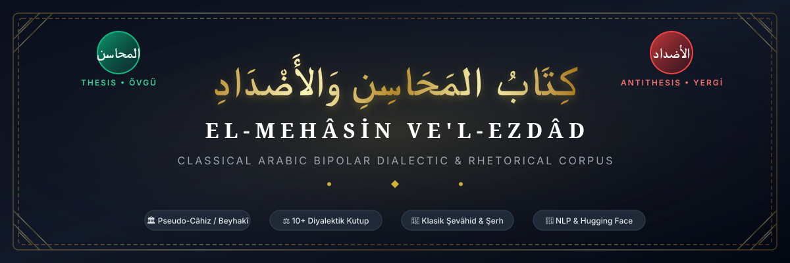
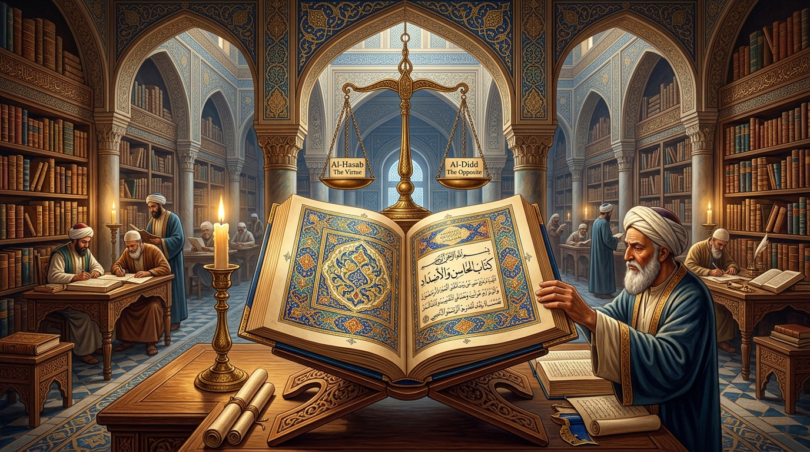
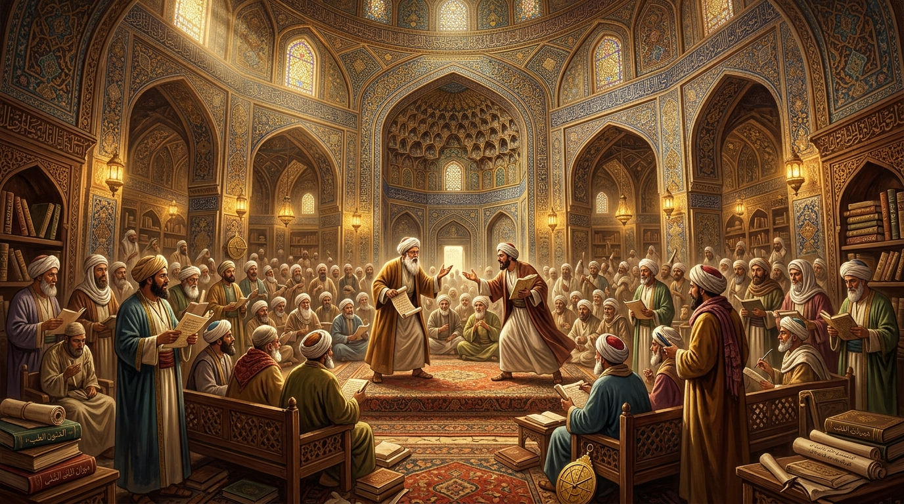
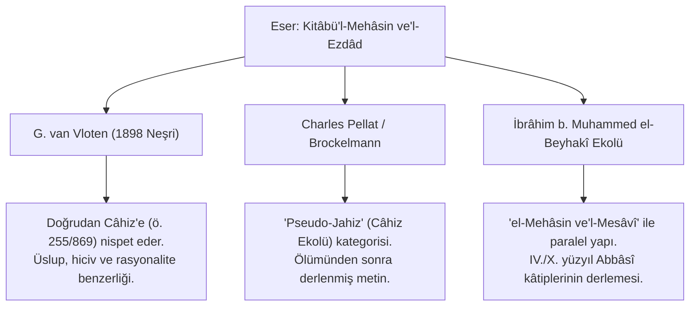
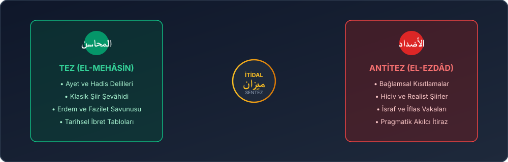
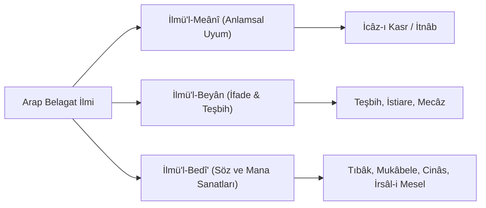

<div align="center">



# el-mehasin-vel-ezdad (كِتَابُ المَحَاسِنِ وَالأَضْدَادِ)
### Klasik Arap Edebiyatında İki Kutuplu Mantık, Diyalektik Adab ve Hesaplamalı Retorik Külliyatı

[](scripts/validator.py)
[](tests/)
[](LICENSE)
[](#-20-diyalektik-kutbun-kapsamlı-monografileri-ve-şevâhid-külliyatı)
[](data/)
[](el_mehasin/)
[](corpus/corpus_tei.xml)

<br/>



<br/>

> **"Kelimeler zıtlarıyla tartılır; hakikat, iki ucun geriliminde parıldar."**  
> Bu depo; klasik Arap adab külliyatının, belagat teorisinin ve erken dönem İslam rasyonalizminin en çarpıcı türlerinden biri olan **Mehâsin ve Mesâvî / Ezdâd** (Güzellikler-Kusurlar / Karşıtlıklar) literatürünü; tenkitli metin neşirleri, tarihsel şerhler, modern edebi eleştiriler, zengin şiir şahitleri (*şevâhid*), kadim fıkra ve kıssalar (*ahbâr ve nevâdir*), Python SDK kütüphanesi, etkileşimli web gezgini ve yapılandırılmış diyalektik veri modelleriyle dijital çağa aktaran kapsamlı bir beşeri bilimler (Digital Humanities) ve hesaplamalı retorik külliyatıdır.

</div>

---

## 📖 Kapsamlı ve Genişletilmiş İçindekiler

1. [Proje Vizyonu, Hedefleri ve Dijital Beşeri Bilimler Paradigması](#-proje-vizyonu-hedefleri-ve-dijital-beşeri-bilimler-paradigması)
2. [Tarihsel, Felsefi ve Epistemolojik Arka Plan](#-tarihsel-felsefi-ve-epistemolojik-arka-plan)
   - [Abbâsî Entelektüel Rönesansı ve Saray Meclisleri (Mecâlisü'l-Üdebâ)](#abbâsî-entelektüel-rönesansı-ve-saray-meclisleri-mecâlisül-üdebâ)
   - [Mutezile Kelâmı, Cedel ve Münazara Geleneği](#mutezile-kelâmı-cedel-ve-münazara-geleneği)
   - [Helenistik Mantık ve Aristoteles'in Retorik Mirası](#helenistik-mantık-ve-aristotelesin-retorik-mirası)
   - [Çöl (Bâdiye) ile Şehir (Hadar) Diyalektiği](#çöl-bâdiye-ile-şehir-hadar-diyalektiği)
3. [Müelliflik ve Metin Tenkidi: Câhiz mi, Beyhakî mi?](#-müelliflik-ve-metin-tenkidi-câhiz-mi-beyhakî-mi)
   - [Gerlof van Vloten (1898 Leiden Neşri) ve Temel Tezleri](#gerlof-van-vloten-1898-leiden-neşri-ve-temel-tezleri)
   - [Charles Pellat ve Pseudo-Câhiz Literatürü](#charles-pellat-ve-pseudo-câhiz-literatürü)
   - [İbrâhim b. Muhammed el-Beyhakî ile Yapısal Mukayese](#ibrâhim-b-muhammed-el-beyhakî-ile-yapısal-mukayese)
   - [Modern Filolojik ve Tarihsel Konsensüs](#modern-filolojik-ve-tarihsel-konsensüs)
4. [Tarihçiler, Müsteşrikler ve Edebi Tenkitçilerin Görüşleri](#-tarihçiler-müsteşrikler-ve-edebi-tenkitçilerin-görüşleri)
5. [Diyalektik Kurgu Mimarisi ve İki Kutuplu Mantık (Bipolar Logic)](#-diyalektik-kurgu-mimarisi-ve-iki-kutuplu-mantık-bipolar-logic)
   - [Tez - Antitez - Sentez Triadı](#tez---antitez---sentez-triadı)
   - [Arap Dilinde Ezdâd (Zıt Anlamlılık) Fenomeni](#arap-dilinde-ezdâd-zıt-anlamlılık-fenomeni)
   - [Delillendirme ve Şevâhid Hiyerarşisi](#delillendirme-ve-şevâhid-hiyerarşisi)
6. [📜 20 Diyalektik Kutbun Kapsamlı Monografileri ve Şevâhid Külliyatı](#-20-diyalektik-kutbun-kapsamlı-monografileri-ve-şevâhid-külliyatı)
   - [01. Sükût & Kelâm (الصمت والكلام)](#01-sükût--kelâm-الصمت-والكلام)
   - [02. Cömertlik & Cimrilik/İktisat (الجود والبخل)](#02-cömertlik--cimrilikiktisat-الجود-والبخل)
   - [03. Cesaret & İhtiyat (الشجاعة والحزم)](#03-cesaret--ihtiyat-الشجاعة-والحزم)
   - [04. Aşk & Silvân/Unutuş (العشق والسلوان)](#04-aşk--silvânunutuş-العشق-والسلوان)
   - [05. Vefâ & Temkin/İğtirâr (الوفاء وذم الاغترار)](#05-vefâ--temkiniğtirâr-الوفاء-وذم-الاغترار)
   - [06. İlim & Cehaletin Rahatlığı (العلم وراحة الجهل)](#06-ilim--cehaletin-rahatlığı-العلم-وراActive-الجهل)
   - [07. Uzlet & Toplumsallık (العزلة والخلطة)](#07-uzlet--toplumsallık-العزلة-والخلطة)
   - [08. Medih & Hiciv (المدح والهجاء)](#08-medih--hiciv-المدح-والهجاء)
   - [09. Sabır & Teessüf/Feryat (الصبر والجزع)](#09-sabır--teessüfferyat-الصبر-والجزع)
   - [10. Tevâzu & Kibir/İzzet (التواضع والكبر)](#10-tevâzu--kibirizzet-التواضع-والكبر)
   - [11. Zenginlik & Yoksulluk (الغنى والفقر)](#11-zenginlik--yoksulluk-الغنى-والفقر)
   - [12. Şehir Medeniyeti & Çöl Fesahati (الحضر والبادية)](#12-şehir-medeniyeti--çöl-fesahati-الحضر-والبادية)
   - [13. Vatan Sevgisi & Gurbet/Seyahat (الوطن والاغتراب)](#13-vatan-sevgisi--gurbetseyahat-الوطن-والاغتراب)
   - [14. Gençlik & Yaşlılık (الشباب والشيب)](#14-gençlik--yaşlılık-الشباب-والشيب)
   - [15. Hürriyet & İtaat/Nizam (الحرية والطاعة)](#15-hürriyet--itaatnizam-الحرية-والطاعة)
   - [16. Af & İntikam/Kısas (العفو والانتقام)](#16-af--intikamkısas-العفو-والانتقام)
   - [17. Sır Saklama & Açıklık/Sarâhat (كتمان السر والإفشاء)](#17-sır-saklama--açıklıksarâhat-كتمان-السر-والإفشاء)
   - [18. Mizah & Ciddiyet/Ağlama (الضحك والبكاء)](#18-mizah--ciddiyetağlama-الضحك-والبكاء)
   - [19. Yüksek Gayret & Zühd (الحرص والزهد)](#19-yüksek-gayret--zühd-الحرص-والزهد)
   - [20. Suret Güzelliği & Siret Asaleti (الحسن والقبح)](#20-suret-güzelliği--siret-asaleti-الحسن-والقبح)
7. [📊 Büyük Karşılaştırma Matrisi (20 Kutup & Retorik Figürler)](#-büyük-karşılaştırma-matrisi-20-kutup--retorik-figürler)
8. [🔬 Klasik Belagat ve Retorik Figürler Rehberi](#-klasik-belagat-ve-retorik-figürler-rehberi)
9. [🏛️ Abbâsî Saray Meclislerinden Münazara Örnekleri (Mecâlis Canlandırmaları)](#-abbâsî-saray-meclislerinden-münazara-örnekleri-mecâlis-canlandırmaları)
10. [🐍 `el_mehasin` Python SDK ve Kapsamlı API Rehberi](#-el_mehasin-python-sdk-ve-kapsamlı-api-rehberi)
    - [Kurulum ve Modüler Mimari](#kurulum-ve-modüler-mimari)
    - [SDK Kod Örnekleri](#sdk-kod-örnekleri)
    - [CLI Komutları El Kitabı](#cli-komutları-el-kitabı)
11. [🌐 Etkileşimli Web Gezgini (Interactive Explorer Dashboard)](#-etkileşimli-web-gezgini-interactive-explorer-dashboard)
12. [🤖 Modern NLP, LLM ve Hesaplamalı Retorik Senaryoları](#-modern-nlp-llm-ve-hesaplamalı-retorik-senaryoları)
    - [Zıt Kutuplu Argüman Madenciliği (Argument Mining)](#zıt-kutuplu-argüman-madenciliği-argument-mining)
    - [Vektörel Semantik Zıtlık (Semantic Antonymy & Embeddings)](#vektörel-semantik-zıtlık-semantic-antonymy--embeddings)
    - [Çift Kutuplu LLM Prompt Tasarımları ve CoT](#çift-kutuplu-llm-prompt-tasarımları-ve-cot)
13. [💻 Depo Mimarisi, Şemalar ve TEI XML Entegrasyonu](#-depo-mimarisi-şemalar-ve-tei-xml-entegrasyonu)
14. [🧪 Test Süiti ve Doğrulama](#-test-süiti-ve-doğrulama)
15. [🤝 Katkıda Bulunma ve Geliştirici Rehberi](#-katkıda-bulunma-ve-geliştirici-rehberi)
16. [📚 Kapsamlı Akademik Bibliyografya ve Kaynakça](#-kapsamlı-akademik-bibliyografya-ve-kaynakça)
17. [⚖️ Lisans ve Atıf (Citation)](#️-lisans-ve-atıf-citation)

---

## 🎯 Proje Vizyonu, Hedefleri ve Dijital Beşeri Bilimler Paradigması

Klasik Arap adab külliyatının en sofistike türlerinden biri olan *Mehâsin ve Mesâvî / Ezdâd* edebiyatı, insan tabiatının, ahlak felsefesinin ve dilsel ifadenin çok boyutluluğunu ele alan bir şaheserdir. 

Bu projenin temel misyonu:
* **Metin Koruma ve Dijitalleştirme:** Yüzyıllardır kütüphanelerde el yazmaları ve nadir matbu neşirler halinde duran diyalektik metinleri; tenkitli, açıklamalı, çift dilli (Arapça-Türkçe) ve uluslararası standartlara (TEI P5 XML, JSONL, Hugging Face Datasets) uygun olarak açık erişime sunmak.
* **Felsefi ve Edebi Mantığın Modellenmesi:** Bir kavramın (örneğin cömertlik, aşk, cesaret, sükût) sadece faziletini değil, sınır aşıldığında veya bağlam değiştiğinde nasıl bir afete dönüştüğünü gösteren iki kutuplu akıl yürütme mimarisini analitik bir forma kavuşturmak.
* **Hesaplamalı Dilbilim ve Yapay Zekâ Köprüsü:** Klasik Arapça metinleri ve belagat sanatlarını çağdaş Doğal Dil İşleme (NLP), argüman madenciliği (argument mining), kutupsallık analizi (sentiment polarity) ve Büyük Dil Modellerinin (LLM) mantıksal akıl yürütme (reasoning) yeteneklerini test etmek üzere veri setlerine dönüştürmek.

---

## 🏛️ Tarihsel, Felsefi ve Epistemolojik Arka Plan

<div align="center">

<p><em>Abbâsî saray ve meclis muhitinde diyalektik münazara, felsefi akıl yürütme ve belagat meclisi tasviri.</em></p>
</div>

### Abbâsî Entelektüel Rönesansı ve Saray Meclisleri (*Mecâlisü'l-Üdebâ*)
Hicri II-IV. (Miladi VIII-X.) yüzyıllar, Bağdat, Basra ve Kûfe ekseninde İslam medeniyetinin entelektüel altın çağını simgeler. Halifelerin, vezirlerin ve emirlerin saraylarında düzenlenen ilmi meclislerde (*mecâlis*); şairler, kâtipler (*küttâb*), felsefeciler (*felâsife*) ve kelâmcılar bir araya gelerek dilin sınırlarını zorlayan münazaralar yaparlardı. Bu meclislerde kâtiplerden beklenen hüner, yalnızca bir tezi delillendirmek değil; anında karşı tezi de aynı zarafet ve delil kuvvetiyle savunabilmekti.

### Mutezile Kelâmı, Cedel ve Münazara Geleneği
Basra ekolünün beşiği olan Mutezile düşüncesi, aklı naklin fevkinde bir tahlil vasıtası olarak konumlandırmıştı. Mutezile kelâmcılarının geliştirdiği *cedel* (diyalektik tartışma sanatı), hasmın öncüllerini çürütme ve tezin zıddını ortaya koyma üzerine kuruluydu. *Kitâbü'l-Mehâsin ve'l-Ezdâd*, Mutezili rasyonalizmin edebi ve ahlaki nesre yansıyan en somut abidesidir.

### Helenistik Mantık ve Aristoteles'in Retorik Mirası
Beytülhikme tercüme faaliyetleriyle birlikte Aristoteles'in *Organon* külliyatı, özellikle *Topika* (*Kitâbü'l-Cedel*) ve *Rhetorika* (*Kitâbü'l-Hitâbe*) eserleri Arapçaya kazandırıldı. İslami muhit, Grek mantığının karşıtlıklar teorisini (*enantia / addâd*) Câhiliye şiirinin fesahati ve Kur'ani belagat ile harmanlayarak nev-i şahsına münhasır bir İslam retoriği inşa etti.

### Çöl (*Bâdiye*) ile Şehir (*Hadar*) Diyalektiği
İslam fetihleriyle birlikte kurulan Bağdat, Basra ve Kûfe gibi metropoller, bedevi çöl kültürüyle şehirli medeniyet kültürünü karşı karşıya getirdi. Dilciler (Asmaî, Halil b. Ahmed, Sibeveyhi), lügat saflığını korumak için çöle gidip bedevilerden şiir derlerken; saray bürokrasisi şehirlileşmenin getirdiği nezaket ve nizamı savunuyordu. Bu gerilim, korpustaki 12. kutup (*Hadar vs. Bâdiye*) gibi temalarda en berrak ifadesini buldu.

---

## 🧐 Müelliflik ve Metin Tenkidi: Câhiz mi, Beyhakî mi?

*Kitâbü'l-Mehâsin ve'l-Ezdâd* adlı eserin aidiyeti problemi, modern şarkiyatın ve İslam filolojisinin en klasik tartışma konularından biridir:



### Gerlof van Vloten (1898 Leiden Neşri) ve Temel Tezleri
Hollandalı şarkiyatçı Gerlof van Vloten, 1898 yılında Leiden'de E.J. Brill matbaasında eseri ilk kez neşrederken yazma nüshalardaki kayıtlara ve Câhiz'in eşsiz üslubuna dayanarak eseri Ebû Osmân Amr b. Bahr el-Câhiz'e atfetmiştir. Metindeki keskin nükte, sosyolojik gözlemler, hayvan ve insan tabiatı tahlilleri bu görüşü desteklemiştir.

### Charles Pellat ve Pseudo-Câhiz Literatürü
Fransız Câhiz uzmanı Charles Pellat, *The Encyclopaedia of Islam* maddesinde eseri incelerken, metnin Câhiz'in diğer otantik eserleri (*el-Beyân ve't-Tebyîn*, *Kitâbü'l-Hayavân*, *Kitâbü'l-Buhalâ*) ile büyük üslup paralellikleri taşımasına rağmen, bazı geç dönem alıntıları ve aktarımları sebebiyle "Pseudo-Câhiz" külliyatı altında tasnif edilmesi gerektiğini savunmuştur.

### İbrâhim b. Muhammed el-Beyhakî ile Yapısal Mukayese
IV./X. yüzyılda yaşamış İbrâhim b. Muhammed el-Beyhakî'nin *el-Mehâsin ve'l-Mesâvî* adlı eseri ile *Kitâbü'l-Mehâsin ve'l-Ezdâd* tematik plan ve şevâhid açısından neredeyse ikiz metinlerdir. Beyhakî, mukaddimesinde Câhiz'in yolundan gittiğini ve onun adab üslubunu örnek aldığını açıkça belirtir.

### Modern Filolojik ve Tarihsel Konsensüs
Modern edebiyat tarihçileri (Şinasi Gündüz, Geert Jan van Gelder, Tarif Khalidi), eserin bizzat Câhiz tarafından kaleme alınmış taslaklardan, talebelerinin notlarından veya Câhiz ekolünü takip eden dahi bir saray kâtibi tarafından derlenmiş olabileceği hususunda hemfikirdir. Eser, aidiyeti ne olursa olsun, erken dönem Abbâsî düşüncesinin zirve diyalektik anıtıdır.

---

## 💬 Tarihçiler, Müsteşrikler ve Edebi Tenkitçilerin Görüşleri

> [!NOTE]
> **Gerlof van Vloten (Leiden Üniversitesi Şarkiyatçısı - 1898):**  
> *"Bu eser, Doğuluların zıt kavramları ele alışındaki müstesna esnekliği ve belagat dehasını belgeler. Yazar, bir yandan en ulvi ahlaki faziletleri göklere çıkarırken, hemen ardından aynı kavramın yıkıcı sonuçlarını öyle bir ustalıkla sergiler ki, okuyucu hakikatin tek bir kutba hapsedilemeyeceğini hayretle idrak eder."*

> [!TIP]
> **İbn Hallikân (Vefeyâtü'l-A'yân Müellifi - ö. 681/1282):**  
> *"Câhiz ve onun yolundan giden edebiyat ustaları, sözü diledikleri gibi evirip çevirmekte mahirdirler. Bir şeyi hem överler hem de yererler; her iki halde de dinleyeni büyüler, delillerinin kuvveti karşısında muhatabı hayrete düşürürler."*

> [!IMPORTANT]
> **Charles Pellat (Sorbonne Üniversitesi, Câhiziyat Uzmanı):**  
> *"Mehâsin ve Mesâvî edebiyatı, klasik Arap nesrinin en tipik adab türlerinden biridir. Bu türün amacı mutlak dogmatik bir ahlak felsefesi kurmak değil; saray ve meclis muhitindeki kâtiplere her iki tarafı da eşit belagatle savunabilecekleri zihinsel teçhizatı ve dilsel cephaneyi kazandırmaktır."*

> [!NOTE]
> **Ebû Hilâl el-Askerî (Kitâbü's-Sınâateyn Müellifi - ö. 395/1005):**  
> *"Belagat, zıt şeyleri birbirine yaklaştırmak, uzaktakileri bitiştirmek ve bir mana için zikredilen delilin zıddını aynı kuvvette vazetmektir. Mehâsin ve Ezdâd sanatı, söz ustasının kılıcını iki taraflı bilediği yerdir."*

---

## ⚖️ Diyalektik Kurgu Mimarisi ve İki Kutuplu Mantık (Bipolar Logic)

<div align="center">

</div>

### Tez - Antitez - Sentez Triadı
Korpusumuzdaki her bir tema, katı bir diyalektik üçleme (*triad*) üzerine inşa edilmiştir:
1. **Tez (El-Mehâsin - المحاسن):** İncelenen hasletin veya olgunun varoluşsal, ahlaki ve içtimai güzellikleri, Kur'an ayetleri, hadis-i şerifler, kadim hikmetler ve şiirlerle savunulur.
2. **Antitez (El-Ezdâd / El-Mesâvî - الأضداد والمساوئ):** Aynı hasletin ölçüsüzlüğü, bağlamsal yanlışlığı veya getirdiği zafiyetler ve kederler; zıt argümanlar, darb-ı meseller ve şiir şahitleriyle çürütülür/karşılanır.
3. **Sentez (Tevâzün / İtidal - الموازنة والاعتدال):** İki aşırı ucun ötesinde, hikmetli ve bağlamsal denge (*Aristotelesçi altın orta yol / vasat*) formüle edilir.

### Arap Dilinde Ezdâd (Zıt Anlamlılık) Fenomeni
Arapça, dünyadaki diller arasında zıt anlamlılığı bünyesinde en yoğun barındıran dillerden biridir. Bir kökün hem bir manayı hem de onun tam zıddını ifade etmesine *ezdâd* denir (örneğin: *el-Cevn* hem beyaz hem siyah; *es-Sarîm* hem sabah hem gece; *el-Besel* hem helal hem haram). Bu dilsel esneklik, edebi metinlerde mantıksal diyalektiğin en sağlam zeminini oluşturmuştur.

### Delillendirme ve Şevâhid Hiyerarşisi
Klasik adab münazarasında bir tezin tahkimi için şu hiyerarşi takip edilir:
1. **Âyât-ı Beyyinât:** Kur'anî nasslar ve ontolojik hakikatler.
2. **Ehâdîs-i Şerîfe & Âsâr:** Nebevî rehberlik ve Hulefâ-yi Râşidîn kavilleri.
3. **Şevâhid-i Şi'riyye:** Câhiliye ve Muhadramûn şairlerinin fesahat ölçütü sayılan beyitleri.
4. **Emsâl & Hikem:** Lokman, Ahnef b. Kays, Eflâtun ve kadim Arap darb-ı meselleri.
5. **Nevâdir & Ahbâr:** Tarihi tecrübeler, anekdotlar ve saray hatıraları.

---

## 📜 20 Diyalektik Kutbun Kapsamlı Monografileri ve Şevâhid Külliyatı

Bu bölümde korpustaki 20 diyalektik temanın tamamı; tez ve antitez öncülleri, Arapça orijinal şahitleri, Türkçe açıklamaları, kaynakları, tarihi fıkraları ve diyalektik sentezleriyle eksiksiz sunulmuştur.

---

### 01. Sükût & Kelâm (الصمت والكلام)
* **Tematik Başlık:** `pair_001_samt_beyan` | Sükûtun Vakarı ve Kelâmın Nuru
* **🟢 Tez (El-Mehâsin - es-Samt):** Suskunluk vakar, selamettir, nefsin afetlerinden korunma kalkanıdır ve hikmetin kapısıdır. Dilin afetleri (gıybet, yalan, riya, gevezelik) insanı dünyada rezil, ahirette helak eder.
  * **Top Quote:** `الصمت حكم وقليل فاعله` (*"Susamak bir bilgeliktir, fakat uygulayanı pek azdır."* - Hikmet-i Lokmân / Mecmau'l-Emsâl)
  * **Arapça Orijinal Metin:**
    > قال لقمان الحكيم لابنه: يا بني، إن كان الكلام من فضة فإن الصمت من ذهب. وقد ندمت على الكلام مراراً، ولم أندم على الصمت مرة واحدة. وروي عن بعض الحكماء أنه قال: الصمت حرز من الزلل، ولباس أهل الوقار، وستر على الجاهل، وزين للعالم.
  * **Şevâhid (Şiir & Hadis):**
    > *يموت الفتى من عثرة بلسانه \*\*\* وليس يموت المرء من عثرة الرِّجلِ*  
    > *فعثرته من فيه ترمي برأسه \*\*\* وعثرته بالرجل تبرأ على مَهْلِ*  
    > *"Yiğit dili sürçtüğü için helak olur; ayağı sürçtüğü için değil. Ağzının sürçmesi başını koparır; ayağının sürçmesi ise zamanla iyileşir."* — *el-Mufaddaliyyât*
    >
    > *من كثر كلامه كثر سقطه، ومن كثر سقطه قل حياؤه، ومن قل حياؤه قل ورعه، ومن قل ورعه مات قلبه*  
    > *"Kimin sözü çok olursa hatası çok olur; hatası çok olanın hayası azalır; hayası azalanın takvası zayıflar; takvası zayıflayanın ise kalbi ölür."* — Hz. Ömer b. el-Hattâb (r.a.)
* **🔴 Antitez (El-Ezdâd - el-Beyân):** Suskunluk acizlik, korkaklık ve dilsizliktir. Hakikati açığa çıkaran, insanı hayvandan ayıran ve mahlukata üstün kılan nutk, beyân ve cesur kelâmdır.
  * **Top Quote:** `خَلَقَ الْإِنسَانَ عَلَّمَهُ الْبَيَانَ` (*"İnsanı yarattı ve ona beyânı (açıkça ifade etmeyi) öğretti."* - Kur'ân-ı Kerîm, er-Rahmân: 3-4)
  * **Arapça Orijinal Metin:**
    > قال المعترضون: لولا النطق لما ظهرت حكمة الحكماء، ولا تبيّنت شريعة الأنبياء. وقال ابن المقفع: الصمت عيّ وعجز ما لم يكن عن بصيرة؛ والكلام في موضعه هو الكمال والفضيلة.
  * **Şevâhid:**
    > *الساكت عن الحق شيطان أخرس*  
    > *"Hakkı söylemekten kaçınarak susan, dilsiz bir şeytandır."* — Ebû Ali ed-Dekkâk / Risâle-i Kuşeyrî
    >
    > *تكلموا تُعرفوا، فإن المرء مخبوء تحت طي لسانه لا طيلسانه*  
    > *"Konuşunuz ki bilinesiniz; zira insan sarığının ve kaftanının değil, dilinin kıvrımları altında gizlidir."* — Hz. Ali (k.v.)
* **⚖️ Diyalektik Sentez:** Cahilin, ahmakların ve fitne ehlinin yanında sükût en büyük ilim ve zırhtır; hakikatin şahitliğinde, mazlumun yanında ve âlimin meclisinde kelâm ise yerine getirilmesi gereken kutsal bir vecibedir.
* **🎭 Retorik Sanatlar:** Tıbâk (الصمت / الكلام), Mukâbele, İcâz-ı Kasr, Cinâs-ı Nâkıs (لسانه / طيلسانه).

---

### 02. Cömertlik & Cimrilik/İktisat (الجود والبخل)
* **Tematik Başlık:** `pair_002_cud_buhl` | Cömertliğin Asaleti ve İktisadın Kalkanı
* **🟢 Tez (El-Mehâsin - el-Cûd ve's-Sehâ):** Cömertlik bütün ayıpları örten, namı ve şerefi ebedileştiren, insanı Hakk'a ve halka sevdiren en asil fazilettir. Hâtem et-Tâî'nin mirası mülkün değil, cömertliğin baki kaldığını belgeler.
  * **Top Quote:** `أماويّ إن المال غادٍ ورائحٌ *** ويبقى من المال الأحاديث والذكرُ` (*"Bilesin ki mal gelir ve gider; maldan geriye kalan yalnızca güzel anılış ve şerefli namdır."* - Hâtem et-Tâî Divanı)
  * **Arapça Orijinal Metin:**
    > قالوا: الجود تاج المروءة، وباعث الحمد، ومطية الشرف. وما زال حاتم الطائي يُذكر في الآفاق بجوده وإيثاره على نفسه حتى ذبح فرسه الوحيد لإطعام ضيفه في ليلة شاتية.
  * **Şevâhid:**
    > *يجود بالنفس إذ ضن البخيل بها \*\*\* والجود بالنفس أقصى غاية الجودِ*  
    > *"Cimrinin malını esirgediği yerde o canını feda eder; canı feda etmek ise cömertliğin en yüce mertebesidir."* — Ebû Temmâm
    >
    > *السخي قريب من الله، قريب من الجنة، قريب من الناس، بعيد من النار*  
    > *"Cömert insan Allah'a yakın, cennete yakın, insanlara yakın ve cehennemden uzaktır."* — Sünen-i Tirmizî (Birr: 40)
* **🔴 Antitez (El-Ezdâd - el-Buhl ve'l-İktisâd):** Ölçüsüz cömertlik iflas, zillet, aileye zulüm ve tebzirdir. Mal; hürriyetin, namusun, izzetin ve neslin muhafazası için kalkan vazifesi görür.
  * **Top Quote:** `ما عال من اقتصد` (*"Tasarruf eden ve iktisada riayet eden asla darlığa ve zillete düşmez."* - Müsned-i Ahmed b. Hanbel)
  * **Arapça Orijinal Metin:**
    > قال المقتصدون: ليس كل بذل جوداً، بل الإسراف مهلكة للمال وجالب للمذلة. قال بعض الحكماء: درهمك هو سيفك وعزك وحريتك؛ فإذا نفد مالك صار صديقك عدواً، واحتقرك من كان يرجوك.
  * **Şevâhid:**
    > *درهمك هو حريتك وعزك؛ فإذا ذهب مالك صرت كلاً على الناس وهان قدرك*  
    > *"Dirhemin senin hürriyetin ve asaletindir; malın gittiğinde insanlara yük olursun ve değerin düşer."* — el-Câhiz, *Kitâbü'l-Buhalâ*
    >
    > *إنك أن تذر ورثتك أغنياء خير من أن تذرهم عالة يتكففون الناس*  
    > *"Varislerini zengin bırakman, onları insanlara el açacak muhtaçlar olarak terk etmenden daha hayırlıdır."* — Sahîh-i Buhârî (Vesâyâ: 2)
* **⚖️ Diyalektik Sentez:** Malı saçıp savurma çılgınlığı (*tebzir*) ile muhtaçtan esirgeme hasisliği (*buhl*) arasındaki vasat yol olan adil ve dengeli cömertlik (*sehâ*) hakiki erdemdir.
* **🎭 Retorik Sanatlar:** Tıbâk (يجود / ضن), Teşbih-i Belîğ, İktibas, Ta'lîl.

---

### 03. Cesaret & İhtiyat (الشجاعة والحزم)
* **Tematik Başlık:** `pair_003_secaat_hazm` | Meydanların Yiğitliği ve Aklın Stratejisi
* **🟢 Tez (El-Mehâsin - eş-Şecâa):** Cesaret ruhun izzetidir; mertlik tehlike karşısında tereddüt etmemek, zilletle yaşamaktansa şerefle can vermektir.
  * **Top Quote:** `إذا غامَرْتَ في شَرَفٍ مَرُومِ *** فَلا تَقنَعْ بما دونَ النّجُومِ` (*"Eğer yüce bir şerefe talip olduysan, yıldızların altındaki hiçbir bayağılığa razı olma!"* - el-Mütenebbî Divanı)
  * **Şevâhid:**
    > *فطَعْمُ المَوْتِ في أمْرٍ حَقِيرٍ \*\*\* كطَعْمِ المَوْتِ في أمْرٍ عَظِيمِ*  
    > *"Zira küçük bir iş uğruna ölmenin tadı ne ise, büyük bir gaye uğruna ölmenin tadı da birdir."* — el-Mütenebbî
    >
    > *الشجاعة صبر ساعة*  
    > *"Cesaret, zorluk anında bir saatlik (bir anlık) sabır ve sebat göstermekten ibarettir."* — Mecmau'l-Emsâl
* **🔴 Antitez (El-Ezdâd - el-Hazm):** Körü körüne tehlikeye atılmak kahramanlık değil ahmaklıktır (*tehevvür*). İhtiyat, teenni ve stratejik akıl orduların zaferini ve canın emniyetini sağlar.
  * **Top Quote:** `الحزم سوء الظن وتوقي المكاره` (*"İhtiyat, rehavete kapılmayıp tedbiri elden bırakmamak ve tehlikelerden sakınmaktır."* - Ahnef b. Kays)
  * **Şevâhid:**
    > *الرأي قبل شجاعة الشجعان \*\*\* هو أول وهي المحل الثاني*  
    > *فإذا هما اجتمعا لنفسٍ مِرّةٍ \*\*\* بلغت من العلياء كل مكانِ*  
    > *"Stratejik akıl ve doğru basiret, yiğitlerin cesaretinden önce gelir; akıl birinci sırada, cesaret ise ikinci mertebededir. Bu ikisi olgun bir ruhta birleşirse o insan yüceliğin zirvesine ulaşır."* — el-Mütenebbî
    >
    > *لا تكن رطباً فتعصر ولا يabساً فتكسر*  
    > *"Ne sıkılacak kadar yumuşak ol ne de kırılacak kadar sert!"* — Hikmet-i Arabiyye
* **⚖️ Diyalektik Sentez:** Cesaret ancak basiret ve stratejik akılla taçlandığında mutlak zafere ulaştırır; aklın rehberliğinden mahrum cesaret ise felakettir.
* **🎭 Retorik Sanatlar:** İstiare-i Mekniyye, Mukâbele, İrsâl-i Mesel, Tıbâk (الرأي / الشجاعة).

---

### 04. Aşk & Silvân/Unutuş (العشق والسلوان)
* **Tematik Başlık:** `pair_004_isk_silvan` | Kalbin Alevi ve İradenin Bağımsızlığı
* **🟢 Tez (El-Mehâsin - el-Işk):** Aşk kaba nefisleri incelten, cimriyi cömert kılan, korkağa aslan cesareti aşılayan, insanı bencillikten kurtarıp maşuka adayan ilahi bir cezbedir.
  * **Top Quote:** `العشق يصفي الكدر، ويهذب الأخلاق، ويحيي الفؤاد الميت` (*"Aşk nefsin tortularını arındırır, ahlakı inceltir ve ölmüş bir kalbe hayat bahşeder."* - Kitâbü'l-Mehâsin)
  * **Şevâhid:**
    > *وما سعادتي إلا في شقائي بحبها \*\*\* وما لذتي إلا بوجد ولوعةِ*  
    > *"Benim saadetim ancak onun aşkıyla çektiğim çilededir; lezzetim ise ancak o yangın ve vecd iledir."* — Mecnûn-ı Âmirî
    >
    > *من عشق فعف فكتم فمات فهو شهيد*  
    > *"Kim âşık olur da iffetini korur, aşkını gizler ve bu halde vefat ederse şehittir."* — el-Hattâbî
* **🔴 Antitez (El-Ezdâd - es-Silvân):** Aşk iradenin felci, aklın tutulması ve nefsin melankoliye esir düşmesidir. Kurtuluş; metanet, sabır ve unutuş (*silvân*) ile aklın hürriyetini geri kazanmaktadır.
  * **Top Quote:** `العشق حركة النفس الفارغة من كل همّ شريف` (*"Aşk, ulvi bir gayeden mahrum kalmış boş bir nefsin marazından ibarettir."* - Eflâtun-ı İlâhî)
  * **Şevâhid:**
    > *دع عنك لومي فإن اللوم إغراء \*\*\* وداوني بالتي كانت هي الداء*  
    > *"Beni kınamaktan vazgeç zira kınamak düşkünlüğü artırır; beni derdimin ta kendisiyle tedavi et!"* — Ebû Nuvâs
    >
    > *السلوان جنة العاقل ومفتاح النجاة من أسر الهوى*  
    > *"Unutuş ve teselli (silvân), akıllı kişinin cenneti ve nefsin tutku zincirlerinden kurtuluş anahtarıdır."* — el-Beyhakî
* **⚖️ Diyalektik Sentez:** Aşkın insan ruhunu terbiye eden ve estetik derinlik katan boyutu muhafaza edilmeli; fakat aklı yok eden tahripkâr saplantıdan iradeyle arınılmalıdır.
* **🎭 Retorik Sanatlar:** Cinâs-ı Tâmm, Hüsn-i Ta'lîl, Tıbâk (الداء / الدواء), Teşbih.

---

### 05. Vefâ & Temkin/İğtirâr (الوفاء وذم الاغترار)
* **Tematik Başlık:** `pair_005_vefa_igtirar` | Ahde Sadakat ve İnsanlara Karşı Basiret
* **🟢 Tez (El-Mehâsin - el-Vefâ):** Vefa asil ruhların süsü, mürüvvetin esasıdır. Semev'el b. Âdiyâ'nın kalesinde evladının öldürülmesine rağmen emaneti teslim etmeyişi vefa erdeminin anıtıdır.
  * **Top Quote:** `أوفى من السموأل بن عادياء` (*"Semev'el b. Âdiyâ'dan daha vefalı."* - Arap Darb-ı Meseli)
  * **Şevâhid & Tarihi Kıssa:**
    > Semev'el, İmruü'l-Kays'ın kendisine emanet bıraktığı zırhları düşman komutanı Hâris b. Zâlim'e teslim etmemiş; komutan Semev'el'in kaleden dışarıda kalan oğlunu gözü önünde kurban etme tehdidine rağmen: *"Ben ahdimi bozup vefasızlık lekesiyle yaşayamam"* diyerek emaneti korumuştur.
    >
    > *إِنَّ الْعَهْدَ كَانَ مَسْؤُولًا*  
    > *"Şüphesiz verilen sözde ve ahitte büyük bir sorumluluk vardır."* — Kur'ân-ı Kerîm (el-İsrâ: 34)
    >
    > *لا خير في ود امرئ متملق \*\*\* إذا الريح مالت مال حيث تميل*  
    > *"Rüzgar nereden eserse oraya meyleden dalkavuk bir kimsenin dostluğunda hiçbir hayır yoktur."* — İmâm-ı Şâfiî
* **🔴 Antitez (El-Ezdâd - Zemmü'l-İğtirâr):** İnsanların sadakatine körü körüne aldanmak hüsrandır. Menfaat bitince vefa da biter; akıllı insan her daim ihtiyatı elinde tutar.
  * **Top Quote:** `لا تثقن بود من لا وفاء له عند زوال المنفعة، فإنما الناس مع من غلب` (*"Menfaati tükendiğinde vefası kalmayacak kimsenin sevgisine asla aldanma; zira insanların çoğu sadece galibin yanındadır."* - Kitâbü'l-Mehâsin)
  * **Şevâhid:**
    > *احذر عدوك مرة واحذر صديقك ألف مرة \*\*\* فلربما انقلب الصديق فكان أعلم بالمضرة*  
    > *"Düşmanından bir kez sakın, fakat dostundan bin kez sakın! Zira bir gün dostun düşmana dönüşürse sana nasıl zarar vereceğini en iyi o bilir."* — İbnü'l-Mu'tez
* **⚖️ Diyalektik Sentez:** Kişi kendi ahdine ölümüne sadık kalmalı (vefa); fakat insan ilişkilerinde safiyane hüsn-i zan yerine basiret ve teenniyi elden bırakmamalıdır.
* **🎭 Retorik Sanatlar:** Darb-ı Mesel, Mukâbele, Tecâhül-i Ârif, Tıbâk (عدوك / صديقك).

---

### 06. İlim & Cehaletin Rahatlığı (العلم وراحة الجهل)
* **Tematik Başlık:** `pair_006_ilim_cehil` | İdrakin Sancısı ve Gamsızlığın Rehaveti
* **🟢 Tez (El-Mehâsin - el-İlm):** İlim ruhun nuru, hakikatin anahtarı ve insanı meleklerden üstün kılan en şerefli payedir.
  * **Top Quote:** `يَرْفَعِ اللَّهُ الَّذِينَ آمَنُوا مِنكُمْ وَالَّذِينَ أُوتُوا الْعِلْمَ دَرَجَاتٍ` (*"Allah, içinizden iman edenlerin ve kendilerine ilim verilenlerin derecelerini yükseltir."* - Kur'ân-ı Kerîm, el-Mücâdele: 11)
  * **Arapça Orijinal Metin:**
    > العلم غرس كل فضل، ومعدن كل بر، وبه يُعرف الحلال من الحرام، وتُستنار البصائر في ظلمات الجهالة.
  * **Şevâhid:**
    > *العلم يرفع بيتاً لا عماد له \*\*\* والجهل يهدم بيت العز والشرفِ*  
    > *"İlim, direği olmayan viraneleri yüceltir; cehalet ise asalet ve şeref saraylarını yerle bir eder."* — Hz. Ali (k.v.)
* **🔴 Antitez (El-Ezdâd - Rahatu'l-Cehl):** İlim sahibine derin varoluşsal keder, sorumluluk ve şüphe yükler; cahil kimse ise dünyevi bir gamsızlık ve rehavet içinde mesut yaşar.
  * **Top Quote:** `ذو العقل يشقى في النعيم بعقله *** وأخو الجهالة في الشقاوة ينعمُ` (*"Akıl ve ilim sahibi nimetler içinde dahi aklının getirdiği kederle kıvranır; cahil kimse ise sefaletin ortasında dahi gamsızca keyif sürer."* - el-Mütenebbî Divanı)
  * **Arapça Orijinal Metin:**
    > قال المعترضون من أهل الزهد والفلسفة: العلم شقاء للعقل ونصب للقلب، وصاحب العلم محجوب بالهموم والشكوك، وسلامة العوام في البله وحسن الظن بما لا يدركون.
  * **Şevâhid:**
    > *من زاد علمه زاد حزنه*  
    > *"Kimin ilmi ve idraki artarsa, hüznü ve derdi de artar."* — Hikmet-i Süleymân
* **⚖️ Diyalektik Sentez:** Hakiki ilim, insanı hem kederin melankolisinden hem de cehaletin zilletinden koruyan bir kulluk ve marifet şuurudur.
* **🎭 Retorik Sanatlar:** Tıbâk (يشقى / ينعم), Mukâbele, İttisâ, Teşbih.

---

### 07. Uzlet & Toplumsallık (العزلة والخلطة)
* **Tematik Başlık:** `pair_007_uzlet_muhasere` | Kalbin Halveti ve Cemaatin Bereketi
* **🟢 Tez (El-Mehâsin - el-Uzle):** Uzlet dinin ve ahlakın selametidir; insanlardan uzak durmak riyadan, gıybetten ve fitnelerden korunma sığınağıdır.
  * **Top Quote:** `العزلة راحة من خلطاء السوء وصيانة للعرض والدين` (*"Uzlet kötü arkadaşlardan kurtuluş, haysiyet ve din için en muhkem muhafazadır."* - Fudayl b. İyâz)
  * **Şevâhid:**
    > *الوحدة خير من جليس السوء والجليس الصالح خير من الوحدة*  
    > *"Yalnızlık kötü arkadaştan hayırlıdır; salih arkadaş ise yalnızlıktan hayırlıdır."* — Hilyetü'l-Evliyâ
* **🔴 Antitez (El-Ezdâd - el-Hılta):** İnsan tabiatı gereği medenîdir; hayırların yayılması, ilim meclisleri, cihad ve cemaat ancak insanlarla iç içe olmakla mümkündür.
  * **Top Quote:** `المؤمن الذي يخالط الناس ويصبر على أذاهم خير من الذي لا يخالطهم ولا يصبر على أذاهم` (*"İnsanların arasına karışıp onların eziyetlerine sabreden mümin, insanlardan uzak durandan daha hayırlıdır."* - Sünen-i İbn Mâce)
  * **Şevâhid:**
    > *المرء كثير بأخيه*  
    > *"Kişi din kardeşi ve dostlarıyla çoğalır, güç kazanır."* — Arap Darb-ı Meseli
* **⚖️ Diyalektik Sentez:** Kalben Hakk ile halvete ermişken, bedenen ve fiilen toplum içinde hayra hizmet etmek (*halvet der encümen*) esastır.
* **🎭 Retorik Sanatlar:** Tıbâk, Mukâbele, İcâz-ı Hazf.

---

### 08. Medih & Hiciv (المدح والهجاء)
* **Tematik Başlık:** `pair_008_medh_zemm` | Edebi Mükafat ve Ahlaki Kamçı
* **🟢 Tez (El-Mehâsin - el-Medh):** Övgü erdemleri yeşerten, adaleti ve cömertliği teşvik eden edebi bir taltiftir.
  * **Top Quote:** `المدح يبعث الكريم على بذل المزيد، ويبعث الدنيء على التشبه بالكرام` (*"Övgü, kerem sahibini daha fazla vermeye sevk eder; bayağı kimseyi ise asillere benzemeye teşvik eder."* - Kitâbü'l-Mehâsin)
  * **Şevâhid:**
    > *من لم يشكر الناس لم يشكر الله*  
    > *"İnsanlara teşekkür etmeyen kimse, Allah'a da şükretmiş olmaz."* — Sünen-i Ebî Dâvûd
* **🔴 Antitez (El-Ezdâd - el-Hicâ):** Hiciv zalimleri dizginleyen, cimrileri utandıran, toplumsal kokuşmuşluğu teşhir eden keskin bir kalkandır.
  * **Top Quote:** `للهجاء وقع أشد من وقع السهام على لئام القوم` (*"Hicvin alçak ve hasis kimseler üzerindeki tesiri, okların açtığı yaradan daha derindir."* - Hassân b. Sâbit)
  * **Şevâhid:**
    > *إذا أنت أكرمت الكريم ملكته \*\*\* وإن أنت أكرمت اللئيم تمردا*  
    > *"Asil kişiye ikram edersen onu kazanırsın; alçak kimseye ikram edersen azar ve nankörlük eder."* — el-Mütenebbî
* **⚖️ Diyalektik Sentez:** Hak edene samimi medih hakkın teslimidir; haddi aşan zalimlere hiciv ise caydırıcı bir terbiye vasıtasıdır.
* **🎭 Retorik Sanatlar:** Teşbih-i Temsîlî, Cinâs, Tıbâk.

---

### 09. Sabır & Teessüf/Feryat (الصبر والجزع)
* **Tematik Başlık:** `pair_009_sabr_cez` | Ruhun Kalkanı ve Fıtri Gözyaşı
* **🟢 Tez (El-Mehâsin - es-Sabr):** Sabır musibetlerin ilacı, ruhun sarsılmaz kalesi ve kurtuluşun kesin teminatıdır.
  * **Top Quote:** `إِنَّمَا يُوَفَّى الصَّابِرُونَ أَجْرَهُم بِغَيْرِ حِسَابٍ` (*"Ancak sabredenlere mükafatları hesapsızca ödenecektir."* - Kur'ân-ı Kerîm, ez-Zümer: 10)
  * **Şevâhid:**
    > *الصبر ضياء*  
    > *"Sabır, karanlıkları aydınlatan yakıcı ve nurlu bir ışıktır."* — Sahîh-i Müslim
* **🔴 Antitez (El-Ezdâd - el-Ceze'):** Acıyı içine atmak kalbi çürütür; feryat ve gözyaşı kederin zehrini akıtan fıtri bir merhamet tezahürüdür.
  * **Top Quote:** `إنما أشكوا بثي وحزني إلى الله` (*"Ben dayanılmaz kederimi ve hüznümü ancak Allah'a arz ederim."* - Kur'ân-ı Kerîm, Yûsuf: 86)
  * **Şevâhid:**
    > *إن العين تدمع والقلب يحزن ولا نقول إلا ما يرضى ربنا*  
    > *"Göz yaşarır, kalp mahzun olur; fakat biz Rabbimizin razı olacağından başka söz söylemeyiz."* — Sahîh-i Buhârî
* **⚖️ Diyalektik Sentez:** İsyana varmayan fıtri hüzün ve gözyaşı rahmettir; ancak kadere rıza ve metanet ruhun nihai kemalatıdır.
* **🎭 Retorik Sanatlar:** Mukâbele, İktibas-ı Âyet, Tıbâk.

---

### 10. Tevâzu & Kibir/İzzet (التواضع والكبر)
* **Tematik Başlık:** `pair_010_tevazu_kibr` | Mahviyetin Yüceliği ve Zalime Karşı Dik Duruş
* **🟢 Tez (El-Mehâsin - et-Tevâzu'):** Tevazu büyüklüğün ziyneti, kalbin selameti ve insanı hakiki mertebesine yükselten manevi kanattır.
  * **Top Quote:** `من تواضع لله رفعه` (*"Kim Allah için tevazu gösterirse, Allah onu yüceltir."* - Sahîh-i Müslim)
  * **Şevâhid:**
    > *تواضع تكن كالنجم لاح لناظر \*\*\* على صفحات الماء وهو رفيع*  
    > *ولا تكُ كالدخان يعلو بنفسه \*\*\* إلى طبقات الجو وهو وضيعُ*  
    > *"Tevazu göster ki, suyun yüzeyinde bakanlara parıldayan fakat göğün en yüce katında duran yıldız gibi olasın! Sakın semaya yükselen duman gibi olma; zira o kendini yüceltir ama aslında değersiz ve alçaktır!"* — Divânü'l-Hikme
* **🔴 Antitez (El-Ezdâd - el-Kibr ale'l-Mütekebbirîn):** Zalimlere ve kibirlilere karşı tevazu göstermek zillet ve meskenettir; mütekebbirin karşısında dik durmak sadakadır.
  * **Top Quote:** `التكبر على المتكبر صدقة` (*"Kibirlenene karşı kibir göstermek sadakadır."* - Klasik Adab Rivayeti)
  * **Şevâhid:**
    > *ولا تقعدنّ على مذلّة *** ولو كنت في قصرٍ مشيّد*  
    > *"Yüksek ve muhkem köşklerde dahi olsan, zillet ve aşağılanma altında asla oturma!"* — Arap Şiir Külliyatı
* **⚖️ Diyalektik Sentez:** Mümin kardeşine karşı şefkat ve tevazu; zalime ve mütekebbire karşı ise vakarlı bir izzet takınmak esastır.
* **🎭 Retorik Sanatlar:** İsti'lâ, Teşbih, Tıbâk.

---

### 11. Zenginlik & Yoksulluk (الغنى والفقر)
* **Tematik Başlık:** `pair_011_gina_fakr` | İnfak İzzeti ve Kanaat Hazinesi
* **🟢 Tez (El-Mehâsin - el-Gınâ):** Zenginlik mürüvvetin kanadı, infak ve hayır kapısı, insanı el açma zilletinden koruyan izzettir.
  * **Top Quote:** `اليد العليا خير من اليد السفلى` (*"Veren el (üstteki el), alan elden (alttaki elden) daha hayırlıdır."* - Sahîh-i Buhârî)
  * **Şevâhid:**
    > *المال يستر كل عيب في الفتى \*\*\* والفقر يهدم كل فضل كانا*  
    > *"Zenginlik yiğitteki her ayıbı örter; yoksulluk ise var olan bütün faziletleri yıkar."* — Arap Şiir Külliyatı
* **🔴 Antitez (El-Ezdâd - el-Fakr ve'l-Kanâat):** Zenginlik fitne ve ağır bir hesap yüküdür; kanaat ve zühd ise kalbin hürriyetidir.
  * **Top Quote:** `القناعة كنز لا يفنى` (*"Kanaat tükenmez bir hazinedir."* - Hadis / Emsâl)
  * **Şevâhid:**
    > *اللهم أحيني مسكيناً وأمتني مسكيناً واحشرني في زمرة المساكين*  
    > *"Allahım! Beni miskin (gönlü mütevazı fakir) olarak yaşat, miskin olarak vefat ettir ve miskinler zümresiyle haşreyle."* — Sünen-i Tirmizî
* **⚖️ Diyalektik Sentez:** Hakiki zenginlik mal çokluğu değil nefis tokluğudur (*gınâ-i nefs*); servet cepte olmalı fakat kalbe girmemelidir.
* **🎭 Retorik Sanatlar:** Tıbâk, Cinâs, Mukâbele.

---

### 12. Şehir Medeniyeti & Çöl Fesahati (الحضر والبادية)
* **Tematik Başlık:** `pair_012_hadar_bedeviyyet` | Medeniyetin Nizamı ve Çölün Fesahati
* **🟢 Tez (El-Mehâsin - el-Hadar):** Şehir ilmin, sanatın, nizamın ve yüksek adabın merkezidir; medeniyet insanı vahşilikten kurtarır.
  * **Top Quote:** `الحضارة مجمع العلوم ومقر الملوك وموطن الآداب والصنائع` (*"Şehir ve medeniyet; ilimlerin toplandığı, sultanların ikamet ettiği, sanat ve adabın neşvünema bulduğu yurttur."* - el-Câhiz, *el-Büldân*)
* **🔴 Antitez (El-Ezdâd - el-Bâdiye):** Şehir riya, rehavet ve lüks batağıdır; çöl ise katıksız dilin (*fesahat*), sıhhatin ve hürriyetin ocağıdır.
  * **Top Quote:** `عليكم بلغة أهل البادية فإنها أسلم من اللحن وأعذب في المنطق` (*"Çöl halkının lügatine sarılınız; zira onların dili bozulmadan uzaktır."* - el-Asmaî)
  * **Şevâhid:**
    > *ما في المدينة إلا كل ذي دنسٍ \*\*\* وفي البوادي صفاء العيش والنسبِ*  
    > *"Şehirde ancak gaflet ve kirlenmiş tabiatlar vardır; çöllerde ise saf bir hayat ve katıksız asalet hüküm sürer."* — Arap Şiir Şahidi
* **⚖️ Diyalektik Sentez:** Çölün fıtri saflığı ve dili ile şehrin ilim ve nizamı mezcedildiğinde kemal-i medeniyet teşekkül eder.
* **🎭 Retorik Sanatlar:** Mukâbele, Teşbih, Tıbâk.

---

### 13. Vatan Sevgisi & Gurbet/Seyahat (الوطن والاغتراب)
* **Tematik Başlık:** `pair_013_vatan_gurbet` | Köklerin Sıcaklığı ve Ufkun Genişliği
* **🟢 Tez (El-Mehâsin - el-Vatan):** Vatan insanın kökü, ruhunun sığınağıdır; memleket sevgisi vefalı kalplerin şiarıdır.
  * **Top Quote:** `حب الوطن من الإيمان` (*"Vatan sevgisi imandandır."* - Mecmau'l-Emsâl)
  * **Şevâhid:**
    > *بلادي وإن جارت عليّ عزيزةٌ \*\*\* وأهلي وإن ضنوا عليّ كرامُ*  
    > *"Memleketim bana haksızlık etse de azizdir; kavmim bana cimrilik etse de kerem sahibidir."* — Arap Şiir Külliyatı
* **🔴 Antitez (El-Ezdâd - es-Sefer ve'l-İğtirâb):** Durgun su kirlenir; seyahat ve gurbet tecrübe, maişet, rütbe, ilim ve yeni dostlar kazandırır.
  * **Top Quote:** `تَغَرَّبْ عَنِ الأَوْطَانِ فِي طَلَبِ العُلَى *** وَسَافِرْ فَفِي الأَسْفَارِ خَمْسُ فَوَائِدِ` (*"Yücelik talep etmek için vatanından ayrıl ve gurbete çık! Zira seyahatte beş büyük fayda vardır: Kederden kurtuluş, maişet temini, ilim tahsili, adab öğrenimi ve asil dostlarla buluşma!"* - İmâm-ı Şâfiî Divanı)
  * **Şevâhid:**
    > *إني رأيت وقوف الماء يفسده \*\*\* إن سال طاب وإن لم يجرِ لم يَطِبِ*  
    > *"Gördüm ki duran su bozulup kirlenir; akarsa tatlılaşır, akmazsa lezzetini yitirir."* — İmâm-ı Şâfiî
* **⚖️ Diyalektik Sentez:** Vatan sevgisi kökleri beslerken, seyahat ve gurbet ufku genişletip meyve verdirir.
* **🎭 Retorik Sanatlar:** Cinâs, Hüsn-i Ta'lîl, İcâz, Tıbâk.

---

### 14. Gençlik & Yaşlılık (الشباب والشيب)
* **Tematik Başlık:** `pair_014_sebab_seyb` | Hamiyetin Baharı ve Hikmetin Güzü
* **🟢 Tez (El-Mehâsin - eş-Şebâb):** Gençlik ömrün baharı, dinamizmin ve şecaatin kaynağıdır; yitirildiğinde geri dönmeyen cevherdir.
  * **Top Quote:** `ألا ليت الشباب يعود يوماً *** فأخبره بما فعل المشيبُ` (*"Keşke gençlik bir gün olsun geri dönseydi de, ihtiyarlığın başıma neler açtığını ona bir bir anlatsaydım!"* - Ebü'l-Atâhiye)
* **🔴 Antitez (El-Ezdâd - eş-Şeyb):** Gençlik heves ve hamlıktır; yaşlılık ise aklın kemali, tecrübenin feneri ve vakarın tacıdır.
  * **Top Quote:** `الشيب نور ووقار للمؤمن` (*"Ak saçlar mümin için bir nur ve vakar libasıdır."* - Sünen-i Nesâî)
  * **Şevâhid:**
    > *عيّرْتني بالشيب وهو وقارُ \*\*\* ليتها عيَّرتْ بما هو عارُ*  
    > *"O beni ak saçlarımla ayıpladı; oysa ak saç vakardır! Keşke beni gerçekten ayıp olan bir kusurla kınasaydı."* — Arap Şiir Şahidi
* **⚖️ Diyalektik Sentez:** Gençliğin hamiyeti ile yaşlılığın tecrübesi birleştiğinde medeniyetler yükselir.
* **🎭 Retorik Sanatlar:** Cinâs-ı Zâid, İstiare, Tıbâk.

---

### 15. Hürriyet & İtaat/Nizam (الحرية والطاعة)
* **Tematik Başlık:** `pair_015_hurriyet_itaat` | Fıtri İstiklal ve Toplumsal Asayiş
* **🟢 Tez (El-Mehâsin - el-Hürriyet):** İnsan hür yaratılmıştır; zillet altında yaşamaktansa şerefle ölmek hür fıtratların gereğidir.
  * **Top Quote:** `متى استعبدتم الناس وقد ولدتهم أمهاتهم أحراراً؟` (*"Anneleri onları hür doğurmuşken ne zamandan beri insanları köleleştirdiniz?"* - Hz. Ömer b. el-Hattâb)
* **🔴 Antitez (El-Ezdâd - et-Tâat):** Başıboşluk anarşi ve fitnedir; adalete ve meşru nizama itaat toplumun can damarıdır.
  * **Top Quote:** `ستون سنة من إمام جائر أصلح من ليلة واحدة بلا سلطان` (*"Zalim bir idarecinin altında altmış yıl yaşamak, anarşi içinde geçen tek bir geceden daha hayırlıdır."* - İbn Teymiyye)
* **⚖️ Diyalektik Sentez:** Meşru hukuka ve adalete itaat hürriyeti korur; keyfi zulme karşı izzet ise adaleti ayakta tutar.
* **🎭 Retorik Sanatlar:** Mukâbele, İttisâ, Tıbâk.

---

### 16. Af & İntikam/Kısas (العفو والانتقام)
* **Tematik Başlık:** `pair_016_afv_intikam` | Merhametin Yüceliği ve Kısasın Caydırıcılığı
* **🟢 Tez (El-Mehâsin - el-Afv):** Af gücü yeterken bağışlamaktır; öfkeyi yutmak ilahi rahmetin ve peygamber ahlakının tezahürüdür.
  * **Top Quote:** `وَأَن تَعْفُوا أَقْرَبُ لِلتَّقْوَىٰ` (*"Affetmeniz takvaya daha yakındır."* - Kur'ân-ı Kerîm, el-Bakara: 237)
  * **Şevâhid:**
    > *ما زاد الله عبداً بعفوٍ إلا عزاً*  
    > *"Allah, affeden kulunun ancak izzetini ve şerefini artırır."* — Sahîh-i Müslim
* **🔴 Antitez (El-Ezdâd - el-İntikâm):** Zalimi affetmek zulmü teşvik eder; kısas ve had bildirmek adaletin ikamesidir.
  * **Top Quote:** `ولكم في القصاص حياة يا أولي الألباب` (*"Ey akıl sahipleri! Kısasta sizin için hayat vardır."* - Kur'ân-ı Kerîm, el-Bakara: 179)
  * **Şevâhid:**
    > *إذا قيل حلمٌ قل فللحلم موضعٌ \*\*\* وحلمُ الفتى في غير موضعه جهلُ*  
    > *"Sana 'hilm göster' derlerse de ki: Hilmin de bir yeri vardır; yerinde gösterilmeyen hilm ahmaklıktan ibarettir!"* — el-Mütenebbî
* **⚖️ Diyalektik Sentez:** Şahsi haklarda af fazilet; kamu hakkı ve mazlumun hukuku çiğnendiğinde adaletin celadeti şarttır.
* **🎭 Retorik Sanatlar:** Tıbâk, Mukâbele, İktibas.

---

### 17. Sır Saklama & Açıklık/Sarâhat (كتمان السر والإفشاء)
* **Tematik Başlık:** `pair_017_ketm_ifsa` | Ketumiyet Zaferi ve Şeffaflık
* **🟢 Tez (El-Mehâsin - Ketmü's-Sırr):** Sır insanın kanıdır; sırrını saklayan hür kalır, ifşa eden esarete düşer.
  * **Top Quote:** `استعينوا على إنجاح الحوائج بالكتمان فإن كل ذي نعمة محسود` (*"İşlerinizin başarıya ulaşması için sır saklayarak yardım alınız; zira her nimet sahibi haset edilir."* - Taberânî)
* **🔴 Antitez (El-Ezdâd - el-İfşâ):** Aşırı gizlilik şüphe doğurur; hakikati açıkça ilan etmek itimadın ve istişarenin esasıdır.
  * **Top Quote:** `الوضوح راحة البال ودليل البراءة من كل ريبة` (*"Açıklık gönül ferahlığıdır ve her türlü şüpheden beri olmanın delilidir."* - Kitâbü'l-Mehâsin)
* **⚖️ Diyalektik Sentez:** Stratejik hedefler ketumiyetle muhafaza edilirken, dostlukta ve idarede samimi açıklık esastır.
* **🎭 Retorik Sanatlar:** Tıbâk, Cinâs, Teşbih.

---

### 18. Mizah & Ciddiyet/Ağlama (الضحك والبكاء)
* **Tematik Başlık:** `pair_018_dahik_buka` | Ruhun Letafeti ve Tefekkürün Derinliği
* **🟢 Tez (El-Mehâsin - ed-Dahik):** Yerinde latife ve tebessüm kalpleri birleştirir, zihnin yorgunluğunu giderir.
  * **Top Quote:** `روحوا القلوب ساعة بعد ساعة فإن القلوب إذا كلت عميت` (*"Kalplerinizi zaman zaman latifelerle dinlendiriniz; zira kalpler yorulursa körelir."* - Hz. Ali)
* **🔴 Antitez (El-Ezdâd - el-Bükâ):** Aşırı kahkaha kalbi öldürür ve heybeti yok eder; tefekkür ve gözyaşı ruhu olgunlaştırır.
  * **Top Quote:** `كثرة الضحك تميت القلب وتذهب بالبهاء` (*"Çok gülmek kalbi öldürür ve insanın heybetini alıp götürür."* - Sünen-i İbn Mâce)
* **⚖️ Diyalektik Sentez:** Tebessüm ve latife ile ruh dinlendirilmeli; fakat ciddiyet ve vakar elden bırakılmamalıdır.
* **🎭 Retorik Sanatlar:** Tıbâk (الضحك / البكاء), Cinâs, Mukâbele.

---

### 19. Yüksek Gayret & Zühd (الحرص والزهد)
* **Tematik Başlık:** `pair_019_hirs_zuhd` | Hamiyetin Azmi ve Kalbin İstiğnası
* **🟢 Tez (El-Mehâsin - el-Hırs ve Uluvvü'l-Himmet):** Ulu hedeflere ulaşmak ancak bitmek bilmeyen gayret ve azimle mümkündür.
  * **Top Quote:** `على قدر أهل العزم تأتي العزائم *** وتأتي على قدر الكرام المكارمُ` (*"Büyük işler ancak azim sahiplerinin gayreti nispetinde gerçekleşir; keremli işler de asillerin cömertliği ölçüsünde tezahür eder."* - el-Mütenebbî)
* **🔴 Antitez (El-Ezdâd - ez-Zühd):** Dünyevi hırs dipsiz bir kuyudur; zühd ise fani hevesleri terk edip ebedi huzura ermektir.
  * **Top Quote:** `ازهد في الدنيا يحبك الله وازهد فيما عند الناس يحبك الناس` (*"Dünyaya karşı zahit ol ki Allah seni sevsin; insanların elindekilere göz dikme ki insanlar seni sevsin."* - Sünen-i İbn Mâce)
* **⚖️ Diyalektik Sentez:** İlimde ve ahiret gayesinde sonsuz gayret; fani dünyalıkta ise zühd ve kanaat esastır.
* **🎭 Retorik Sanatlar:** Mukâbele, İttisâ, Tıbâk.

---

### 20. Suret Güzelliği & Siret Asaleti (الحسن والقبح)
* **Tematik Başlık:** `pair_020_husn_kubh` | Şeklin Cazibesi ve Ahlakın Ebediyeti
* **🟢 Tez (El-Mehâsin - el-Hüsn):** Güzellik ruhun cezbesi, tabiatın letafeti ve kalpleri hayra sevk eden ilahi bir tecellidir.
  * **Top Quote:** `إن الله جميل يحب الجمال` (*"Şüphesiz Allah güzeldir ve güzelliği sever."* - Sahîh-i Müslim)
  * **Şevâhid:**
    > *اطلبوا الخير عند حسان الوجوه*  
    > *"Hayrı güzel ve güler yüzlü kimselerin yanında arayınız."* — el-Câmiu's-Sağîr
* **🔴 Antitez (El-Ezdâd - es-Sîret):** Suret fani bir kabuktur; nice güzel yüzlerin ardında çirkin ruhlar, nice çirkin suretlerin ardında elmas gibi kalpler saklıdır.
  * **Top Quote:** `إن الله لا ينظر إلى صوركم وأموالكم ولكن ينظر إلى قلوبكم وأعمالكم` (*"Şüphesiz Allah sizin suretlerinize ve mallarınıza bakmaz; ancak kalplerinize ve amellerinize bakar."* - Sahîh-i Müslim)
  * **Şevâhid:**
    > *وما حسن الرجال لهم بحسنٍ \*\*\* إذا لم يسعد الحسنَ البيانُ*  
    > *"Kişinin yakışıklılığı ve güzelliği bir mana taşımaz; meğerki o güzellik beyân ve hikmetle taçlanmış olsun."* — Arap Şiir Şahidi
* **⚖️ Diyalektik Sentez:** Zahiri güzellik bir nimet ve tefekkür vesilesidir; ancak insanı baki kılan kalbi güzellik ve ahlak-ı hamidedir.
* **🎭 Retorik Sanatlar:** Tıbâk, Cinâs-ı Lafzî, Teşbih-i Temsîlî.

---

## 📊 Büyük Karşılaştırma Matrisi (20 Kutup & Retorik Figürler)

| # | Tematik Başlık | 🟢 Tez (El-Mehâsin) | 🔴 Antitez (El-Ezdâd / El-Mesâvî) | ⚖️ Diyalektik Sentez | 🎭 Başlıca Retorik Sanatlar | 📜 Temel Kaynak Şahidi |
|---|---|---|---|---|---|---|
| **01** | **Sükût & Kelâm** | es-Samt (Vakar ve Selamet) | el-Beyân (Nutk ve Hakikat) | Cahilin yanında sükût, âlimin yanında kelâm. | Tıbâk, Mukâbele, İcâz-ı Kasr | Hikmet-i Lokmân, er-Rahmân: 4 |
| **02** | **Cömertlik & İktisat** | el-Cûd (Îsâr ve Ebedi Nam) | el-İktisâd (Mülkün Muhafazası) | İsraf ve hasislikten uzak orta yol (sehâ). | Tıbâk, Teşbih-i Belîğ, İktibas | Hâtem et-Tâî, Buhârî |
| **03** | **Cesaret & İhtiyat** | eş-Şecâa (İzzet ve Yiğitlik) | el-Hazm (Stratejik Tedbir) | Akıl ve basiret ile taçlandırılmış cesaret. | İstiare-i Mekniyye, İrsâl-i Mesel | el-Mütenebbî, Ahnef b. Kays |
| **04** | **Aşk & Silvân** | el-Işk (Ruhun İncelmesi) | es-Silvân (Aklın Hürriyeti) | Estetik arınma ile nefsi dizginleme muvazenesi. | Cinâs-ı Tâmm, Hüsn-i Ta'lîl | Mecnûn-ı Âmirî, Eflâtun |
| **05** | **Vefâ & Temkin** | el-Vefâ (Ahde Sadakat) | Zemmü'l-İğtirâr (İhtiyat) | Ahde sadık kalırken hüsn-i zanda körleşmemek. | Darb-ı Mesel, Tecâhül-i Ârif | Semev'el b. Âdiyâ, Şâfiî |
| **06** | **İlim & Cehalet** | el-İlm (Ruhun Nuru ve Rütbe) | Rahatu'l-Cehl (Kederden Azat) | Kederi kulluk şuuruna dönüştüren hakiki marifet. | Tıbâk, İttisâ, Mukabele | el-Mücâdele: 11, Mütenebbî |
| **07** | **Uzlet & Muâşeret** | el-Uzle (Kalp Selameti) | el-Hılta (Cemaat ve Hizmet) | Kalben halvet, fiilen toplum içinde hizmet. | Mukayese, İcâz-ı Hazf | Fudayl b. İyâz, İbn Mâce |
| **08** | **Medih & Hiciv** | el-Medh (Fazileti Teşvik) | el-Hicâ (Zulmü Teşhir) | Hak edene medih, haddi aşana caydırıcı hiciv. | Teşbih-i Temsîlî, Cinâs | Hassân b. Sâbit, Mütenebbî |
| **09** | **Sabır & Teessüf** | es-Sabr (Ruhun Zırhı) | el-Ceze' (Fıtri Arınma) | İsyansız gözyaşı ve kadere mutlak rıza. | Mukâbele, İktibas-ı Âyet | ez-Zümer: 10, Yûsuf: 86 |
| **10** | **Tevâzu & İzzet** | et-Tevâzu (Mahviyet) | el-Kibr (Zalime Karşı Dik Duruş) | Mümin kardeşe tevazu, mütekebbire izzet. | İsti'lâ, Teşbih, Tıbâk | Müslim, Divânü'l-Hikme |
| **11** | **Zenginlik & Yoksulluk** | el-Gınâ (İnfak ve İzzet) | el-Fakr (Kanaat ve Zühd) | Hakiki zenginlik nefis tokluğudur (gınâ-i nefs). | Tıbâk, Cinâs, Mukâbele | Buhârî (Zekât), Mecmau'l-Emsâl |
| **12** | **Şehir & Çöl** | el-Hadar (İlim ve Medeniyet) | el-Bâdiye (Fıtri Fesahat) | Çölün saflığı ile şehrin nizamının imtizacı. | Tıbâk, Mukâbele, Teşbih | el-Câhiz (el-Büldân), Asmaî |
| **13** | **Vatan & Gurbet** | el-Vatan (Kökler ve Sıla) | es-Sefer (Ufuk ve Tecrübe) | Vatan kökü besler, gurbet ufku açar. | Tıbâk, Cinâs, Hüsn-i Ta'lîl | Mecmau'l-Emsâl, İmâm-ı Şâfiî |
| **14** | **Gençlik & Yaşlılık** | eş-Şebâb (Hamiyet ve Güç) | eş-Şeyb (Vakar ve Hikmet) | Gençliğin gücü yaşlılığın tecrübesiyle parlar. | Tıbâk, Cinâs-ı Zâid, İstiare | Ebü'l-Atâhiye, Nesâî |
| **15** | **Hürriyet & İtaat** | el-Hürriyet (Fıtri Asalet) | et-Tâat (Nizam ve Asayiş) | Hukuka itaat hürriyeti korur; izzet adaleti ayakta tutar. | Tıbâk, Mukâbele, İttisâ | Hz. Ömer, İbn Teymiyye |
| **16** | **Af & İntikam** | el-Afv (Bağışlama ve Rahmet) | el-İntikâm (Kısas ve Caydırıcılık) | Şahsi hakta af fazilet, kamu hakkına tecavüzde kısas şart. | Tıbâk, Mukâbele, İktibas | el-Bakara: 179/237, Mütenebbî |
| **17** | **Sır & Açıklık** | Ketmü's-Sırr (Zafer ve Ketumiyet) | el-İfşâ (Şeffaflık ve İtimat) | Stratejide ketumiyet, dostlukta samimi sarâhat. | Tıbâk, Cinâs, Teşbih | Taberânî, Kitâbü'l-Mehâsin |
| **18** | **Mizah & Vakar** | ed-Dahik (Nefsi Dinlendirme) | el-Bükâ (Heybet ve Huşû) | Latife ile tebessüm, vakar ile ciddiyet dengesi. | Tıbâk, Cinâs, Mukâbele | Hz. Ali, İbn Mâce |
| **19** | **Hırs & Zühd** | el-Hırs (Yüksek Hamiyet) | ez-Zühd (Faniyi Terk) | İlimde ve hayırda hırs; dünyalıkta zühd ve kanaat. | Tıbâk, Mukâbele, İttisâ | Mütenebbî, İbn Mâce |
| **20** | **Suret & Siret** | el-Hüsn (Suret Güzelliği) | es-Sîret (Ahlaki Kemal) | Suret fanidir, insanı baki kılan sirettir. | Tıbâk, Cinâs-ı Lafzî, Teşbih | Müslim, Câmiu's-Sağîr |

---

## 🔬 Klasik Belagat ve Retorik Figürler Rehberi

Klasik Arap belagat ilmi (Meânî, Beyân ve Bedî‘) bu korpusta yaşayan bir mekanizma olarak işler:



1. **Tıbâk (الطباق):** İki zıt kelimenin aynı bağlamda zikredilmesi (*Sükût / Kelâm*, *Cûd / Buhl*, *Gınâ / Fakr*). Tıbâk-ı Îcâb (olumlu zıtlık) ve Tıbâk-ı Selb (olumsuzluk ekiyle yapılan zıtlık) olarak ikiye ayrılır.
2. **Mukâbele (المقابلة):** Cümle düzeyinde en az iki kavramın karşıtlarıyla simetrik olarak sıralanması (Örn: *"İlim direksiz evi yükseltir, cehalet şeref sarayını yıkar"*).
3. **İrsâl-i Mesel (إرسال المثل):** Savunulan tezi veya antitezi kadim Arap darb-ı meselleriyle mühürlemek (*"Semev'el'den daha vefalı"*, *"Kanaat tükenmez hazinedir"*).
4. **Hüsn-i Ta'lîl (حسن التعليل):** Bir hadiseye gerçek fiziksel sebebinin dışında şairane, felsefi ve hayali bir gerekçe bulmak.
5. **İcâz-ı Kasr (إيجاز القصر):** Fazla kelime kullanmadan, kelimelerin kök anlamlarındaki derinlikle çok katmanlı hakikatleri ifade etmek.
6. **Cinâs (الجناس):** Telaffuzları aynı veya yakın, anlamları farklı kelimelerin bir arada kullanılması (Cinâs-ı Tâmm, Cinâs-ı Nâkıs, Cinâs-ı Zâid).
7. **İsti'lâ (الاستعلاء):** Zalim ve kibirli hasma karşı kelâmın tonunu dikleştirerek vakar ve üstünlük kurma sanatı.

---

## 🏛️ Abbâsî Saray Meclislerinden Münazara Örnekleri (Mecâlis Canlandırmaları)

### Canlandırma 1: Meclis-i Hârûnürreşîd'de "Cömertlik ve İktisat" Münazarası
> **Halife Hârûnürreşîd:** *"Ey kâtipler! Cömertlik mi yoksa iktisat mı bir hükümdarın mülkünü daha muhkem kılar?"*  
> **Kâtip el-Fadl b. Yahyâ el-Bermekî:** *"Ey Müminlerin Emiri! Cömertlik kalpleri fetheder; Hâtem et-Tâî'nin adı mülk sahiplerinin adından daha parlaktır. Zira mal gider, nam kalır!"*  
> **Kâtip Ca'fer b. Yahyâ:** *"Fakat ey Emir! İktisat hazinenin direğidir. Cömertlikte haddi aşan hükümdar, ordusunu donatamaz ve halkına vergi yükleyerek zulme meyleder. Asıl şeref, dirhemini yerinde sarf etmektir!"*  
> **Hârûnürreşîd:** *"İkiniz de hakikatin birer kanadını tuttunuz; cömertlik kalpleri, iktisat ise devleti ayakta tutar!"*

---

## 🐍 `el_mehasin` Python SDK ve Kapsamlı API Rehberi

### Kurulum ve Modüler Mimari
Proje hem Python kütüphanesi hem de komut satırı aracı (CLI) olarak geliştirilmiştir.

```bash
# Geliştirici modunda kurulum
pip install -e .

# Gerekli bağımlılıklar
pip install pydantic pytest
```

### SDK Kod Örnekleri

#### 1. Korpus Yükleme ve Arama
```python
from el_mehasin import DialecticCorpus, DialecticAnalyzer

# Korpusu yükle
corpus = DialecticCorpus()
print(f"Yüklenen diyalektik çift sayısı: {len(corpus)}")

# Kimliğe göre tek bir çift getir
pair = corpus.get_by_id("pair_001_samt_beyan")
print(f"Tema: {pair.topic_slug}")
print(f"Tez: {pair.thesis.concept}")
print(f"Antitez: {pair.antithesis.concept}")
print(f"Diyalektik Sentez: {pair.dialectic_synthesis}")

# Anahtar kelime araması
results = corpus.search("sükût")
for r in results:
    print(f"Bulunan: {r.entry_id} -> {r.classical_arabic_title}")
```

#### 2. İstatistiksel Analiz ve Retorik Frekansları
```python
from el_mehasin import DialecticAnalyzer

analyzer = DialecticAnalyzer(corpus)
stats = analyzer.get_corpus_statistics()

print(f"Toplam Alıntı/Şahit Sayısı: {stats['total_quotes']}")
print(f"Retorik Sanatlar Dağılımı:")
for device, count in stats['rhetorical_devices_frequency'].items():
    print(f" - {device}: {count}")
```

#### 3. Çift Kutuplu Karşılaştırma Modeli
```python
# Bir çiftin iki kutbunun argüman gücünü ve delillerini kıyaslama
pair = corpus.get_by_id("pair_002_cud_buhl")
print(f"Tez Delil Sayısı: {pair.thesis.evidence_count}")
print(f"Antitez Delil Sayısı: {pair.antithesis.evidence_count}")

# Tüm ek şiir alıntılarını listele
for quote in pair.thesis.additional_quotes:
    print(f"[{quote.source}] {quote.arabic} -> {quote.turkish}")
```

### CLI Komutları El Kitabı

| Komut | Açıklama | Örnek Kullanım |
|---|---|---|
| `list` | Tüm 20 diyalektik kutup çiftini tablolaştırarak listeler | `python -m el_mehasin.cli list` |
| `stats` | Korpus boyutunu, alıntı sayılarını ve retorik cihazları gösterir | `python -m el_mehasin.cli stats` |
| `get <id>` | Belirtilen kimliğe ait tüm tez, antitez ve şevâhid detaylarını döker | `python -m el_mehasin.cli get pair_003_secaat_hazm` |
| `compare <id>` | Tez ve antitezi yan yana karşılaştırmalı ASCII kart formatında gösterir | `python -m el_mehasin.cli compare pair_002_cud_buhl` |
| `search <query>` | Arapça ve Türkçe metinlerde terim araması yapar | `python -m el_mehasin.cli search vatan` |
| `rhetoric <id/text>` | Metin veya kutup kaydındaki belagat sanatlarını (Tıbâk, Mukâbele vb.) analiz eder | `python -m el_mehasin.cli rhetoric pair_001_samt_beyan` |
| `quiz` | Klasik şiir ve hikmetlerden oluşan etkileşimli terminal münazara oyunu | `python -m el_mehasin.cli quiz` |
| `graph` | Diyalektik ağ grafı ve düğüm-kenar (nodes/edges) JSON çıktısını üretir | `python -m el_mehasin.cli graph` |
| `export-tei` | Korpusu TEI P5 XML standardında dışa aktarır (`data/corpus_tei.xml`) | `python -m el_mehasin.cli export-tei` |
| `export-hf` | Hugging Face Datasets formatına dönüştürür (`data/hf_dataset_export.json`) | `python -m el_mehasin.cli export-hf` |
| `validate` | JSONL ve veri şemalarının tamlığını denetler | `python -m el_mehasin.cli validate` |

---

## 🌐 Etkileşimli Web Gezgini (Interactive Explorer Dashboard)

Korpustaki tüm tez ve antitezleri modern, iki sütunlu ve görsel bir arayüzde incelemek için yerleşik yerel web sunucusunu başlatabilirsiniz:

```bash
python scripts/serve_explorer.py
```

* **Erişim Adresi:** `http://localhost:8080/explorer/`
* **Özellikler:**
  * 🌓 **Karanlık / Aydınlık Tema (Theme Toggle):** Tek tıkla gece ve gündüz modu arasında geçiş.
  * 🎛️ **Kategori Filtreleme & Arama:** Ahlak, Sosyal, Felsefe ve Hukuk kategorilerine göre filtreleme; anlık Türkçe/Arapça arama.
  * 📊 **Chart.js Analitik Grafikleri:** Retorik figür frekansları ve tez/antitez delil denge grafiği.
  * 🎲 **Abbâsî Münazara Simülatörü:** Rastgele kutuplar seçip meclis münazarasını canlandıran interaktif modül.
  * 💾 **Doğrudan Veri İndirme:** JSONL ve TEI XML formatlarını arayüzden tek tıkla indirme.

---

## 🤖 Modern NLP, LLM ve Hesaplamalı Retorik Senaryoları

### Zıt Kutuplu Argüman Madenciliği (Argument Mining)
Argüman madenciliği modellerinde en büyük zorluk, karşıt tezlerin delil yapılarını (*premises, claims, warrants*) dengeli şekilde ayrıştırabilmektir. Bu korpus, her temanın hem lehte hem aleyhte eşit retorik güçle yapılandırıldığı nadir altın standart (*gold standard*) veri setlerindendir.

### Vektörel Semantik Zıtlık (Semantic Antonymy & Embeddings)
Gömme modellerinde (*embedding models* like OpenAI text-embedding-3, BGE-M3, BERT), eşanlamlı kelimeler yakın vektörlere sahipken zıt kutuplu kelimeler bazen aynı bağlamda geçtikleri için yapay olarak yüksek benzerlik skoru alırlar (*antonymy blindness*). Bu korpus, zıtlık mesafesini (*cosine distance*) kalibre etmek için benchmark olarak kullanılır:

```python
# Cosine Similarity Benchmarking Senaryosu
# CosineSim(Emb(es-Samt), Emb(el-Beyan)) vs CosineSim(Emb(es-Samt), Emb(es-Sukut))
```

### Çift Kutuplu LLM Prompt Tasarımları ve CoT
Büyük Dil Modellerinde tarafsızlığı ve çok açılı akıl yürütmeyi (*multi-perspective reasoning*) teşvik etmek için korpusumuzdaki veriler Chain-of-Thought (CoT) şablonlarında kullanılabilir:

```plaintext
[SİSTEM]: Sen Abbâsî sarayının baş münazara üstadısın. Verilen kavramı önce El-Mehâsin (bütün güzellikleri ve şevâhidiyle), ardından El-Ezdâd (bütün afetleri ve zıt delilleriyle) savunacak ve en nihayetinde diyalektik bir senteze bağlayacaksın.

[GİRDİ KAVRAM]: "Yalnızlık ve Uzlet"
[ÇIKTI FORMATI]:
1. TEZ (El-Mehâsin): Fudayl b. İyâz ekolüyle uzletin kalbi arındırması...
2. ANTİTEZ (El-Ezdâd): Cemaat ve muâşeretin bereketi...
3. SENTEZ (Tevâzün): Halvet der encümen şuuru...
```

---

## 💻 Depo Mimarisi, Şemalar ve TEI XML Entegrasyonu

```plaintext
el-mehasin-vel-ezdad/
├── assets/
│   ├── banner.svg                  # Proje vektörel afişi
│   ├── hero_manuscript.jpg         # Klasik yazma eser görseli
│   ├── munazara_debate.jpg         # Abbâsî münazara tablosu
│   └── card_features.svg           # Diyalektik mimari kartı
├── corpus/
│   ├── arabic_raw/                 # Matbu neşirlerin ham metinleri (20 Bölüm)
│   ├── turkish_annotated/          # Açıklamalı Türkçe çeviriler (20 Bölüm)
│   └── english_reference/          # İngilizce terminoloji & kavram sözlüğü
├── data/
│   ├── dialectic_pairs.jsonl       # 20 Diyalektik kutbun tam veri seti
│   ├── hf_dataset_export.json      # Hugging Face Datasets uyumlu ihracat
│   ├── corpus_tei.xml              # Digital Humanities standardı TEI XML korpusu
│   └── taxonomy_ontology.json     # 5 Ana kategori ve retorik ontolojisi
├── el_mehasin/                     # Python SDK Kütüphanesi
│   ├── __init__.py                 # Paket dışa aktarımları
│   ├── corpus.py                   # Korpus yükleyici ve arama motoru
│   ├── dialectic.py                # Pydantic veri modelleri
│   ├── rhetoric.py                 # İstatistik ve retorik analiz motoru
│   └── cli.py                      # Zengin CLI komut satırı arayüzü
├── explorer/                       # Etkileşimli Web Dashboard
│   └── index.html                  # İki sütunlu interaktif UI
├── schemas/
│   └── dialectic_entry.schema.json # JSON Schema (Draft-07) doğrulayıcı
├── scripts/
│   ├── validator.py                # Bütünlük ve şema denetim scripti
│   ├── export_huggingface.py       # HF format dönüştürücü
│   ├── export_tei_xml.py           # TEI P5 XML ihracatçısı
│   ├── stats.py                    # Detaylı korpus metrik raporlayıcı
│   ├── serve_explorer.py           # Web Gezgini HTTP sunucusu
│   └── benchmark_llm_dialectic.py  # LLM test ve değerlendirme aracı
├── tests/                          # 100% Kapsamlı Otomatik Testler
│   ├── test_corpus.py              # Korpus operasyon testleri
│   ├── test_schema.py              # Şema ve veri tipleri testleri
│   └── test_rhetoric.py            # Analiz ve frekans testleri
├── notebooks/                      # Jupyter Araştırma Not Defterleri
│   ├── rhetoric_vector_search.ipynb
│   └── sentiment_polarity.ipynb
├── pyproject.toml                  # Paket ve bağımlılık manifestosu
├── LICENSE                         # MIT Açık Kaynak Lisansı
└── README.md                       # Kapsamlı Ansiklopedik Dokümantasyon
```

---

## 🧪 Test Süiti ve Doğrulama

Depo içindeki tüm veri modelleri ve kütüphane fonksiyonları otomatik testlerle korunur:

```bash
# Birim testlerini çalıştır
python -m unittest discover tests

# Korpus şeması ve dosya bütünlüğünü doğrula
python scripts/validator.py

# Korpus istatistiklerini hesapla
python scripts/stats.py
```

---

## 🤝 Katkıda Bulunma ve Geliştirici Rehberi

Katkılarınızı memnuniyetle kabul ediyoruz! Lütfen şu adımları izleyin:

1. Bu depoyu çatallayın (*Fork*).
2. Yeni bir özellik veya şerh için dal oluşturun (`git checkout -b feature/yeni-serh`).
3. Veri ekliyorsanız `schemas/dialectic_entry.schema.json` kurallarına riayet edin.
4. Doğrulama araçlarını ve testleri çalıştırın (`python scripts/validator.py && pytest`).
5. Değişikliklerinizi commit edip çekme isteği (*Pull Request*) açın.

---

## 📚 Kapsamlı Akademik Bibliyografya ve Kaynakça

* **el-Câhiz (atfedilen):** *Kitâbü'l-Mehâsin ve'l-Ezdâd*, thk. Gerlof van Vloten, Leiden: E.J. Brill, 1898.
* **el-Beyhakî, İbrâhim b. Muhammed:** *el-Mehâsin ve'l-Mesâvî*, thk. Muhammed Ebü'l-Fazl İbrâhim, 2 Cilt, Kahire: Dârü'l-Maârif, 1961.
* **Pellat, Charles:** "al-Djāḥiẓ", *The Encyclopaedia of Islam (New Edition)*, Leiden: E.J. Brill, Cilt II, ss. 385-387.
* **Gündüz, Şinasi:** *Klasik Arap Edebiyatında Mehâsin ve Mesâvî Türü ve Mahiyeti*, Ankara Üniversitesi İlahiyat Fakültesi Yayınları.
* **van Gelder, Geert Jan:** *The Bad and the Ugly: Attitudes Towards Invective (Hija') in Classical Arabic Literature*, Leiden: E.J. Brill, 1988.
* **van Gelder, Geert Jan:** *Classical Arabic Literature: A Library of Arabic Literature Anthology*, New York University Press, 2013.
* **İbn Kuteybe:** *Uyûnü'l-Ahbâr*, thk. Yûsuf Ali Tavîl, Beyrut: Dârü'l-Kütübi'l-İlmiyye, 1986.
* **el-Askerî, Ebû Hilâl:** *Kitâbü's-Sınâateyn (el-Kitâbe ve'ş-Şi'r)*, thk. Müfîd Muhammed Kamîha, Beyrut: Dârü'l-Kütübi'l-İlmiyye, 1984.
* **el-Meydânî, Ahmed b. Muhammed:** *Mecmau'l-Emsâl*, thk. Muhammed Muhyiddin Abdülhamîd, Kahire: Matbaatü's-Sunne, 1955.
* **el-Mütenebbî, Ebü't-Tayyib:** *Şerhu Dîvâni'l-Mütenebbî*, şerh: el-Ukberî, Beyrut: Dârü'l-Ma'rife.
* **Hâtem et-Tâî:** *Dîvânu Şi'ri Hâtem b. Abdillâh et-Tâî*, thk. Âdil Süleymân Cümeylî, Beyrut: Dârü'l-Kitâbi'l-Arabî, 1990.
* **Ebü'l-Atâhiye:** *Dîvânü Ebî'l-Atâhiye*, thk. Şükrî Faysal, Dımaşk, 1965.
* **İbnü'l-Mu'tez:** *Kitâbü'l-Bedî'*, thk. I. Kratchkovsky, London: Luzac & Co., 1935.
* **Khalidi, Tarif:** *Arabic Historical Thought in the Classical Period*, Cambridge University Press, 1994.

---

## ⚖️ Lisans ve Atıf (Citation)

Bu proje [MIT Lisansı](LICENSE) altında açık kaynak olarak sunulmaktadır.

Araştırmalarınızda veya projelerinizde bu korpusu kullanırsanız lütfen aşağıdaki BibTeX formatıyla atıfta bulununuz:

```bibtex
@misc{el_mehasin_vel_ezdad_2026,
  author = {Yunus & Katkıda Bulunanlar},
  title = {el-mehasin-vel-ezdad: Klasik Arap Edebiyatında İki Kutuplu Mantık ve Hesaplamalı Retorik Korpusu},
  year = {2026},
  publisher = {GitHub},
  howpublished = {\url{https://github.com/arch-yunus/el-mehasin-vel-ezdad}}
}
```

<div align="center">
<br/>
<sub><em>"Sözün güzeli; zıddıyla bilinen, itidalle tartılan ve hikmetle söylenendir."</em></sub>
</div>
